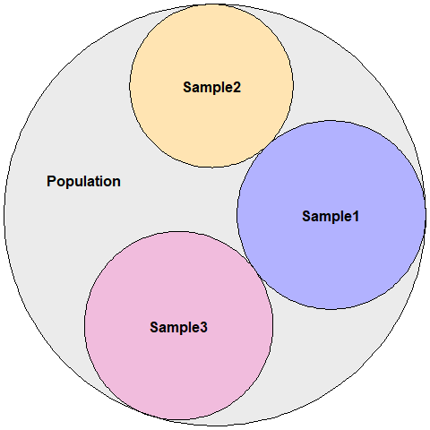

# Goals of this module
The goal of this module is to introduce basic concepts of statistics and how to make the correct interpretation of the results. Moreover, you will be able to construct your own functions to analyse your data. 


# What is statistics?
*Statistics* is the part of the scientific method that aims to collect, reduce, analyse and model real data. Statistics helps the analyse and presentation of data, and is also involved with the design of experiments, planning and defining how to collect the data in order to achieve results minimizing errors.

In the end, the statistical analysis should be able to tell us something concrete about the sample that we are studying and allow us to make inferences towards a population.

<!-- -->

Statistics is normally divided into two main methods:
*Descriptive statistics* and *Inferential statistics*.

The descriptive analysis gives an *overview* about the sample and the inferential analysis tests hypothesis about the population.

Before we can understand **what** the data is revealing us, we have to be able to split the variables in its correct category. 

## Types of variables
The variables can be classified into two main groups:

1. **Qualitative** or **Categorical**
  i. **Nominal** (There are no order for the labels)
    - i.e.. Country, Gender, Brand of preference, Sides of a coin.
  ii. **Ordinal** (There are an order on the labels)
    - i.e.. Degree, State of a disease.

2. **Quantitative** or **Numerical**
    i. **Discrete** (Countable)
      -  i.e.. The number of kids, Number of births/deaths.
    ii. **Continuous**
       - i.e.. Temperature, Age.

In this course, we will use as an example, the data from GSE$5388$, a data set containing data from patients with Bipolar Disorder. In our data-set we have some phenotype data, and the log transform of the gene expression of some genes.


```r
data = read.csv("Course_2019/Pheno_DE.csv", header = T, row.names = 1)

data[1:5,1:10]
```


```r
names(data)
```

```
##  [1] "X"                         "Age_death"                
##  [3] "Age_onset"                 "Alcohol_abuse"            
##  [5] "Brain_ph"                  "Status"                   
##  [7] "Drug_abuse"                "Duration_illness"         
##  [9] "Therapy_Electroconvulsive" "Therapy_Fluphenazine"     
## [11] "Gender"                    "Therapy_Lithium"          
## [13] "Post_morten_interval"      "Side_brain"               
## [15] "Suicide"                   "Therapy_Valproate"        
## [17] "APOLD1"                    "CLDN10"                   
## [19] "DUSP4"                     "EFEMP1"                   
## [21] "ETNPPL"                    "GJA1"                     
## [23] "PLSCR4"                    "SDC4"                     
## [25] "SLC14A1"                   "SOX9"                     
## [27] "SST"                       "TAC1"                     
## [29] "CX3CR1"                    "DDX3Y"                    
## [31] "ETNPPL.1"                  "G3BP2"                    
## [33] "GABRG2"                    "KDM5D"                    
## [35] "MAFB"                      "NBEA"                     
## [37] "OXR1"                      "PAK1"                     
## [39] "PCDH8"                     "PPID"                     
## [41] "PVALB"                     "RPS4Y1"                   
## [43] "SST.1"                     "TAC1.1"                   
## [45] "TBL1XR1"                   "USP9Y"                    
## [47] "XIST"
```

### Exercise
1. Define the type of each variable in our data set. 
