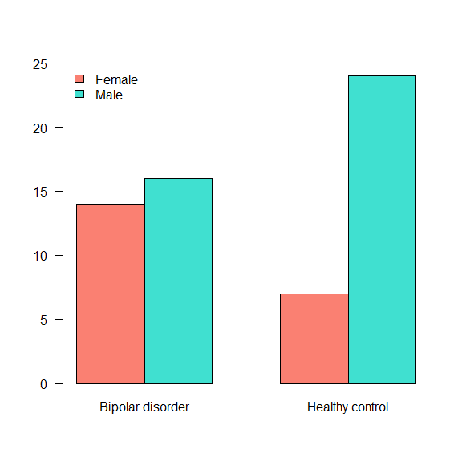

# Descriptive Statistics
{: .no_toc }


## Table of contents
{: .no_toc .text-delta }

1. TOC
{:toc}

---

$x^2 + y = z$
## Frequency Tables
Frequency tables can be used for all kinds of variables, however, it's preferable to be used for the *categorical*. However, if you use it for numerical data, the values of the variable have to be divided into *ranges*.

To get an absolute frequency table using R, 
the easiest way is by using the function `table()`, 
and for a relative frequency table `prop.table()`.


```r
table(data$Gender) # Creates an absolute frequency table of Gender
```

```
## 
## Female   Male 
##     21     40
```

```r
table(data$Status)
```

```
## 
## Bipolar disorder  Healthy control 
##               30               31
```

```r
require(magrittr) # Allows using pipe inside R
```

```
## Loading required package: magrittr
```

```r
table(data$Gender) %>% # Pipes the absolute freq. table into
  prop.table()         # a relative freq. table
```

```
## 
##    Female      Male 
## 0.3442623 0.6557377
```

What happens if we ask for a `prop.table()` on an object that is not a table?


```r
 # prop.table(data$Gender)
```

The `table()` function also allows us to create cross-tables. For that, the input is two variables.

```r
table(data$Gender, data$Status)
```

```
##         
##          Bipolar disorder Healthy control
##   Female               14               7
##   Male                 16              24
```

```r
table(data$Gender, data$Status) %>% 
  prop.table(.) %>% 
  round(.,2)
```

```
##         
##          Bipolar disorder Healthy control
##   Female             0.23            0.11
##   Male               0.26            0.39
```

Normally `barplot()` is used to represent visually a frequency table.


```r
table(data$Gender, data$Status) %>% 
  barplot(., beside = TRUE, 
          legend.text = TRUE, 
          col = c('salmon','turquoise'), 
          args.legend = list(x = 'topleft',
                             bty = 'n'),
          ylim = c(0,25),
          las = 1)
```

<!-- -->


## Central tendency measures
The **central tendency measures** attempts to summarise/describe the dataset by its central position. 
The *mean*, *median* and *mode* are examples of central measurements.

The **five-number summary** is a set of descriptive statistics that provide information about a dataset. 
It consists of five quartiles:

1. $Q_0$ the lowest value of the sample, aka **Minimum**
1. $Q_1$ $25\%$ of the sample, aka **lower quantile**
1. $Q_2$ $50\%$ of the sample, aka **median**
1. $Q_3$ $75\%$ of the sample, aka **upper quantile**
1. $Q_4$ the biggest value of the sample, aka **Maximum**

The functions `summary()` and `fivenum()` returns the five-number summary. They are a bit different how they calculate the $1^{st}$ and $3^{rd}$ quantiles.
`summary()` calculates the average of the two numbers, if even, `fivenum()` returns the minimum. 


```r
### The function summary will give you an overview of the full data set if you want to!
summary(data)
```

```
##          X        Age_death       Age_onset     Alcohol_abuse  
##  GSM123182: 1   Min.   :19.00   Min.   :14.00   Min.   :0.000  
##  GSM123183: 1   1st Qu.:38.00   1st Qu.:18.25   1st Qu.:0.000  
##  GSM123184: 1   Median :45.00   Median :22.00   Median :1.000  
##  GSM123185: 1   Mean   :44.18   Mean   :24.03   Mean   :1.817  
##  GSM123186: 1   3rd Qu.:49.00   3rd Qu.:27.75   3rd Qu.:3.250  
##  GSM123187: 1   Max.   :64.00   Max.   :45.00   Max.   :5.000  
##  (Other)  :55                   NA's   :31      NA's   :1      
##     Brain_ph                  Status     Drug_abuse     Duration_illness
##  Min.   :5.920   Bipolar disorder:30   Min.   :0.0000   Min.   : 2.00   
##  1st Qu.:6.400   Healthy control :31   1st Qu.:0.0000   1st Qu.:14.00   
##  Median :6.600                         Median :0.0000   Median :18.50   
##  Mean   :6.553                         Mean   :0.1935   Mean   :20.50   
##  3rd Qu.:6.740                         3rd Qu.:0.0000   3rd Qu.:27.75   
##  Max.   :7.030                         Max.   :3.0000   Max.   :45.00   
##                                        NA's   :30       NA's   :31      
##  Therapy_Electroconvulsive Therapy_Fluphenazine    Gender  
##  No  :28                   Min.   :     0       Female:21  
##  Yes : 2                   1st Qu.:     0       Male  :40  
##  NA's:31                   Median :  3000                  
##                            Mean   : 11283                  
##                            3rd Qu.: 12000                  
##                            Max.   :130000                  
##                            NA's   :32                      
##  Therapy_Lithium Post_morten_interval Side_brain Suicide 
##  No  :22         Min.   : 9.00        Left :32   No :49  
##  Yes : 8         1st Qu.:23.00        Right:29   Yes:12  
##  NA's:31         Median :31.00                           
##                  Mean   :33.05                           
##                  3rd Qu.:39.00                           
##                  Max.   :84.00                           
##                                                          
##  Therapy_Valproate     APOLD1          CLDN10          DUSP4      
##  No  :20           Min.   :1.765   Min.   :1.822   Min.   :1.445  
##  Yes :10           1st Qu.:1.917   1st Qu.:1.984   1st Qu.:1.522  
##  NA's:31           Median :1.957   Median :2.042   Median :1.562  
##                    Mean   :1.997   Mean   :2.042   Mean   :1.573  
##                    3rd Qu.:2.113   3rd Qu.:2.113   3rd Qu.:1.632  
##                    Max.   :2.286   Max.   :2.181   Max.   :1.718  
##                                                                   
##      EFEMP1          ETNPPL           GJA1           PLSCR4     
##  Min.   :1.585   Min.   :1.903   Min.   :1.840   Min.   :1.683  
##  1st Qu.:1.766   1st Qu.:2.115   1st Qu.:2.154   1st Qu.:1.861  
##  Median :1.847   Median :2.194   Median :2.235   Median :1.905  
##  Mean   :1.835   Mean   :2.183   Mean   :2.219   Mean   :1.903  
##  3rd Qu.:1.916   3rd Qu.:2.278   3rd Qu.:2.309   3rd Qu.:1.971  
##  Max.   :2.049   Max.   :2.367   Max.   :2.409   Max.   :2.079  
##                                                                 
##       SDC4          SLC14A1           SOX9            SST       
##  Min.   :1.740   Min.   :1.156   Min.   :1.819   Min.   :1.782  
##  1st Qu.:1.984   1st Qu.:1.291   1st Qu.:1.981   1st Qu.:2.083  
##  Median :2.028   Median :1.320   Median :2.063   Median :2.172  
##  Mean   :2.021   Mean   :1.340   Mean   :2.040   Mean   :2.137  
##  3rd Qu.:2.087   3rd Qu.:1.400   3rd Qu.:2.109   3rd Qu.:2.206  
##  Max.   :2.178   Max.   :1.669   Max.   :2.237   Max.   :2.277  
##                                                                 
##       TAC1           CX3CR1          DDX3Y          ETNPPL.1    
##  Min.   :1.549   Min.   :1.749   Min.   :1.397   Min.   :1.903  
##  1st Qu.:1.837   1st Qu.:1.865   1st Qu.:1.484   1st Qu.:2.115  
##  Median :1.911   Median :1.979   Median :1.764   Median :2.194  
##  Mean   :1.885   Mean   :1.974   Mean   :1.674   Mean   :2.183  
##  3rd Qu.:1.974   3rd Qu.:2.072   3rd Qu.:1.807   3rd Qu.:2.278  
##  Max.   :2.071   Max.   :2.263   Max.   :1.891   Max.   :2.367  
##                                                                 
##      G3BP2           GABRG2          KDM5D            MAFB      
##  Min.   :1.790   Min.   :1.722   Min.   :1.494   Min.   :1.660  
##  1st Qu.:1.937   1st Qu.:1.974   1st Qu.:1.677   1st Qu.:1.869  
##  Median :1.994   Median :2.088   Median :1.959   Median :1.919  
##  Mean   :1.988   Mean   :2.061   Mean   :1.863   Mean   :1.900  
##  3rd Qu.:2.044   3rd Qu.:2.166   3rd Qu.:2.000   3rd Qu.:1.951  
##  Max.   :2.117   Max.   :2.245   Max.   :2.054   Max.   :2.047  
##                                                                 
##       NBEA            OXR1            PAK1           PCDH8      
##  Min.   :1.868   Min.   :1.622   Min.   :1.333   Min.   :1.727  
##  1st Qu.:2.089   1st Qu.:1.896   1st Qu.:1.584   1st Qu.:1.941  
##  Median :2.110   Median :1.983   Median :1.709   Median :1.997  
##  Mean   :2.094   Mean   :1.951   Mean   :1.679   Mean   :1.986  
##  3rd Qu.:2.143   3rd Qu.:2.030   3rd Qu.:1.784   3rd Qu.:2.053  
##  Max.   :2.202   Max.   :2.151   Max.   :1.901   Max.   :2.113  
##                                                                 
##       PPID           PVALB           RPS4Y1          SST.1      
##  Min.   :1.808   Min.   :1.779   Min.   :1.640   Min.   :1.782  
##  1st Qu.:1.986   1st Qu.:1.987   1st Qu.:1.768   1st Qu.:2.083  
##  Median :2.017   Median :2.052   Median :2.227   Median :2.172  
##  Mean   :2.004   Mean   :2.030   Mean   :2.065   Mean   :2.137  
##  3rd Qu.:2.051   3rd Qu.:2.087   3rd Qu.:2.248   3rd Qu.:2.206  
##  Max.   :2.109   Max.   :2.154   Max.   :2.280   Max.   :2.277  
##                                                                 
##      TAC1.1         TBL1XR1          USP9Y            XIST      
##  Min.   :1.549   Min.   :1.504   Min.   :1.160   Min.   :1.424  
##  1st Qu.:1.837   1st Qu.:1.742   1st Qu.:1.293   1st Qu.:1.462  
##  Median :1.911   Median :1.805   Median :1.483   Median :1.497  
##  Mean   :1.885   Mean   :1.789   Mean   :1.454   Mean   :1.701  
##  3rd Qu.:1.974   3rd Qu.:1.856   3rd Qu.:1.589   3rd Qu.:2.106  
##  Max.   :2.071   Max.   :1.990   Max.   :1.796   Max.   :2.264  
## 
```


```r
### or just the variable you want.
summary(data$Age_death)
```

```
##    Min. 1st Qu.  Median    Mean 3rd Qu.    Max. 
##   19.00   38.00   45.00   44.18   49.00   64.00
```

```r
fivenum(data$Age_death)
```

```
## [1] 19 38 45 49 64
```

```r
###  (minimum, lower-hinge, median, upper-hinge, maximum)
```

The graphical representation of the summary is the `boxplot()`.


```r
boxplot(data$Age_onset, 
        las = 2, 
        pch = 4,
        col = 'salmon')
```

<!-- -->

If we are interested in the summary **by** condition, we can use the function `by()`.


```r
by(data, data$Status, 
   FUN = summary)
```

```
## data$Status: Bipolar disorder
##          X        Age_death       Age_onset     Alcohol_abuse  
##  GSM123182: 1   Min.   :19.00   Min.   :14.00   Min.   :0.000  
##  GSM123183: 1   1st Qu.:41.00   1st Qu.:18.25   1st Qu.:1.000  
##  GSM123184: 1   Median :44.00   Median :22.00   Median :3.000  
##  GSM123185: 1   Mean   :44.53   Mean   :24.03   Mean   :2.862  
##  GSM123186: 1   3rd Qu.:50.75   3rd Qu.:27.75   3rd Qu.:5.000  
##  GSM123187: 1   Max.   :64.00   Max.   :45.00   Max.   :5.000  
##  (Other)  :24                                   NA's   :1      
##     Brain_ph                  Status     Drug_abuse  Duration_illness
##  Min.   :5.920   Bipolar disorder:30   Min.   : NA   Min.   : 2.00   
##  1st Qu.:6.355   Healthy control : 0   1st Qu.: NA   1st Qu.:14.00   
##  Median :6.505                         Median : NA   Median :18.50   
##  Mean   :6.475                         Mean   :NaN   Mean   :20.50   
##  3rd Qu.:6.665                         3rd Qu.: NA   3rd Qu.:27.75   
##  Max.   :6.970                         Max.   : NA   Max.   :45.00   
##                                        NA's   :30                    
##  Therapy_Electroconvulsive Therapy_Fluphenazine    Gender  
##  No :28                    Min.   :     0       Female:14  
##  Yes: 2                    1st Qu.:     0       Male  :16  
##                            Median :  3000                  
##                            Mean   : 11283                  
##                            3rd Qu.: 12000                  
##                            Max.   :130000                  
##                            NA's   :1                       
##  Therapy_Lithium Post_morten_interval Side_brain Suicide 
##  No :22          Min.   :12.00        Left :18   No :18  
##  Yes: 8          1st Qu.:23.25        Right:12   Yes:12  
##                  Median :35.00                           
##                  Mean   :37.17                           
##                  3rd Qu.:47.00                           
##                  Max.   :84.00                           
##                                                          
##  Therapy_Valproate     APOLD1          CLDN10          DUSP4      
##  No :20            Min.   :1.807   Min.   :1.889   Min.   :1.445  
##  Yes:10            1st Qu.:1.941   1st Qu.:2.006   1st Qu.:1.506  
##                    Median :1.983   Median :2.051   Median :1.540  
##                    Mean   :2.024   Mean   :2.062   Mean   :1.548  
##                    3rd Qu.:2.117   3rd Qu.:2.136   3rd Qu.:1.572  
##                    Max.   :2.286   Max.   :2.181   Max.   :1.718  
##                                                                   
##      EFEMP1          ETNPPL           GJA1           PLSCR4     
##  Min.   :1.616   Min.   :2.000   Min.   :2.014   Min.   :1.701  
##  1st Qu.:1.796   1st Qu.:2.163   1st Qu.:2.200   1st Qu.:1.890  
##  Median :1.867   Median :2.204   Median :2.260   Median :1.916  
##  Mean   :1.853   Mean   :2.215   Mean   :2.244   Mean   :1.921  
##  3rd Qu.:1.922   3rd Qu.:2.287   3rd Qu.:2.309   3rd Qu.:1.989  
##  Max.   :2.003   Max.   :2.367   Max.   :2.374   Max.   :2.078  
##                                                                 
##       SDC4          SLC14A1           SOX9            SST       
##  Min.   :1.855   Min.   :1.168   Min.   :1.819   Min.   :1.782  
##  1st Qu.:2.007   1st Qu.:1.309   1st Qu.:2.039   1st Qu.:2.032  
##  Median :2.058   Median :1.346   Median :2.087   Median :2.093  
##  Mean   :2.051   Mean   :1.363   Mean   :2.067   Mean   :2.084  
##  3rd Qu.:2.106   3rd Qu.:1.405   3rd Qu.:2.121   3rd Qu.:2.170  
##  Max.   :2.158   Max.   :1.583   Max.   :2.237   Max.   :2.277  
##                                                                 
##       TAC1           CX3CR1          DDX3Y          ETNPPL.1    
##  Min.   :1.549   Min.   :1.762   Min.   :1.397   Min.   :2.000  
##  1st Qu.:1.771   1st Qu.:1.826   1st Qu.:1.445   1st Qu.:2.163  
##  Median :1.849   Median :1.961   Median :1.723   Median :2.204  
##  Mean   :1.825   Mean   :1.940   Mean   :1.627   Mean   :2.215  
##  3rd Qu.:1.928   3rd Qu.:2.021   3rd Qu.:1.783   3rd Qu.:2.287  
##  Max.   :2.029   Max.   :2.149   Max.   :1.839   Max.   :2.367  
##                                                                 
##      G3BP2           GABRG2          KDM5D            MAFB      
##  Min.   :1.790   Min.   :1.722   Min.   :1.494   Min.   :1.660  
##  1st Qu.:1.903   1st Qu.:1.946   1st Qu.:1.626   1st Qu.:1.810  
##  Median :1.979   Median :2.050   Median :1.945   Median :1.900  
##  Mean   :1.958   Mean   :2.022   Mean   :1.814   Mean   :1.869  
##  3rd Qu.:2.015   3rd Qu.:2.117   3rd Qu.:1.994   3rd Qu.:1.945  
##  Max.   :2.107   Max.   :2.240   Max.   :2.034   Max.   :2.031  
##                                                                 
##       NBEA            OXR1            PAK1           PCDH8      
##  Min.   :1.868   Min.   :1.622   Min.   :1.333   Min.   :1.727  
##  1st Qu.:2.013   1st Qu.:1.845   1st Qu.:1.512   1st Qu.:1.906  
##  Median :2.101   Median :1.934   Median :1.659   Median :1.965  
##  Mean   :2.061   Mean   :1.916   Mean   :1.644   Mean   :1.953  
##  3rd Qu.:2.122   3rd Qu.:1.999   3rd Qu.:1.772   3rd Qu.:2.005  
##  Max.   :2.176   Max.   :2.101   Max.   :1.882   Max.   :2.076  
##                                                                 
##       PPID           PVALB           RPS4Y1          SST.1      
##  Min.   :1.808   Min.   :1.779   Min.   :1.685   Min.   :1.782  
##  1st Qu.:1.916   1st Qu.:1.941   1st Qu.:1.755   1st Qu.:2.032  
##  Median :1.996   Median :2.014   Median :2.201   Median :2.093  
##  Mean   :1.973   Mean   :2.000   Mean   :2.013   Mean   :2.084  
##  3rd Qu.:2.017   3rd Qu.:2.073   3rd Qu.:2.235   3rd Qu.:2.170  
##  Max.   :2.097   Max.   :2.112   Max.   :2.280   Max.   :2.277  
##                                                                 
##      TAC1.1         TBL1XR1          USP9Y            XIST      
##  Min.   :1.549   Min.   :1.504   Min.   :1.160   Min.   :1.434  
##  1st Qu.:1.771   1st Qu.:1.682   1st Qu.:1.283   1st Qu.:1.479  
##  Median :1.849   Median :1.775   Median :1.401   Median :1.534  
##  Mean   :1.825   Mean   :1.753   Mean   :1.404   Mean   :1.791  
##  3rd Qu.:1.928   3rd Qu.:1.834   3rd Qu.:1.526   3rd Qu.:2.127  
##  Max.   :2.029   Max.   :1.914   Max.   :1.680   Max.   :2.264  
##                                                                 
## -------------------------------------------------------- 
## data$Status: Healthy control
##          X        Age_death       Age_onset   Alcohol_abuse   
##  GSM123212: 1   Min.   :31.00   Min.   : NA   Min.   :0.0000  
##  GSM123213: 1   1st Qu.:38.00   1st Qu.: NA   1st Qu.:0.0000  
##  GSM123214: 1   Median :45.00   Median : NA   Median :0.0000  
##  GSM123215: 1   Mean   :43.84   Mean   :NaN   Mean   :0.8387  
##  GSM123216: 1   3rd Qu.:48.50   3rd Qu.: NA   3rd Qu.:1.0000  
##  GSM123217: 1   Max.   :59.00   Max.   : NA   Max.   :4.0000  
##  (Other)  :25                   NA's   :31                    
##     Brain_ph                  Status     Drug_abuse     Duration_illness
##  Min.   :6.000   Bipolar disorder: 0   Min.   :0.0000   Min.   : NA     
##  1st Qu.:6.500   Healthy control :31   1st Qu.:0.0000   1st Qu.: NA     
##  Median :6.700                         Median :0.0000   Median : NA     
##  Mean   :6.628                         Mean   :0.1935   Mean   :NaN     
##  3rd Qu.:6.810                         3rd Qu.:0.0000   3rd Qu.: NA     
##  Max.   :7.030                         Max.   :3.0000   Max.   : NA     
##                                                         NA's   :31      
##  Therapy_Electroconvulsive Therapy_Fluphenazine    Gender  
##  No  : 0                   Min.   : NA          Female: 7  
##  Yes : 0                   1st Qu.: NA          Male  :24  
##  NA's:31                   Median : NA                     
##                            Mean   :NaN                     
##                            3rd Qu.: NA                     
##                            Max.   : NA                     
##                            NA's   :31                      
##  Therapy_Lithium Post_morten_interval Side_brain Suicide 
##  No  : 0         Min.   : 9.00        Left :14   No :31  
##  Yes : 0         1st Qu.:21.50        Right:17   Yes: 0  
##  NA's:31         Median :28.00                           
##                  Mean   :29.06                           
##                  3rd Qu.:36.50                           
##                  Max.   :58.00                           
##                                                          
##  Therapy_Valproate     APOLD1          CLDN10          DUSP4      
##  No  : 0           Min.   :1.765   Min.   :1.822   Min.   :1.469  
##  Yes : 0           1st Qu.:1.889   1st Qu.:1.974   1st Qu.:1.538  
##  NA's:31           Median :1.942   Median :2.026   Median :1.618  
##                    Mean   :1.971   Mean   :2.022   Mean   :1.597  
##                    3rd Qu.:2.065   3rd Qu.:2.097   3rd Qu.:1.656  
##                    Max.   :2.284   Max.   :2.146   Max.   :1.707  
##                                                                   
##      EFEMP1          ETNPPL           GJA1           PLSCR4     
##  Min.   :1.585   Min.   :1.903   Min.   :1.840   Min.   :1.683  
##  1st Qu.:1.760   1st Qu.:2.067   1st Qu.:2.127   1st Qu.:1.848  
##  Median :1.804   Median :2.166   Median :2.199   Median :1.883  
##  Mean   :1.817   Mean   :2.152   Mean   :2.196   Mean   :1.885  
##  3rd Qu.:1.902   3rd Qu.:2.242   3rd Qu.:2.302   3rd Qu.:1.957  
##  Max.   :2.049   Max.   :2.329   Max.   :2.409   Max.   :2.079  
##                                                                 
##       SDC4          SLC14A1           SOX9            SST       
##  Min.   :1.740   Min.   :1.156   Min.   :1.842   Min.   :1.996  
##  1st Qu.:1.963   1st Qu.:1.269   1st Qu.:1.966   1st Qu.:2.172  
##  Median :2.003   Median :1.300   Median :2.018   Median :2.197  
##  Mean   :1.992   Mean   :1.318   Mean   :2.013   Mean   :2.189  
##  3rd Qu.:2.045   3rd Qu.:1.339   3rd Qu.:2.087   3rd Qu.:2.225  
##  Max.   :2.178   Max.   :1.669   Max.   :2.194   Max.   :2.275  
##                                                                 
##       TAC1           CX3CR1          DDX3Y          ETNPPL.1    
##  Min.   :1.760   Min.   :1.749   Min.   :1.440   Min.   :1.903  
##  1st Qu.:1.897   1st Qu.:1.923   1st Qu.:1.722   1st Qu.:2.067  
##  Median :1.945   Median :1.987   Median :1.770   Median :2.166  
##  Mean   :1.944   Mean   :2.006   Mean   :1.720   Mean   :2.152  
##  3rd Qu.:1.996   3rd Qu.:2.098   3rd Qu.:1.810   3rd Qu.:2.242  
##  Max.   :2.071   Max.   :2.263   Max.   :1.891   Max.   :2.329  
##                                                                 
##      G3BP2           GABRG2          KDM5D            MAFB      
##  Min.   :1.898   Min.   :1.840   Min.   :1.543   Min.   :1.760  
##  1st Qu.:1.959   1st Qu.:2.024   1st Qu.:1.921   1st Qu.:1.901  
##  Median :2.035   Median :2.139   Median :1.977   Median :1.938  
##  Mean   :2.018   Mean   :2.099   Mean   :1.909   Mean   :1.931  
##  3rd Qu.:2.069   3rd Qu.:2.180   3rd Qu.:2.000   3rd Qu.:1.961  
##  Max.   :2.117   Max.   :2.245   Max.   :2.054   Max.   :2.047  
##                                                                 
##       NBEA            OXR1            PAK1           PCDH8      
##  Min.   :2.029   Min.   :1.641   Min.   :1.431   Min.   :1.866  
##  1st Qu.:2.097   1st Qu.:1.963   1st Qu.:1.646   1st Qu.:1.987  
##  Median :2.134   Median :2.005   Median :1.723   Median :2.021  
##  Mean   :2.125   Mean   :1.985   Mean   :1.713   Mean   :2.019  
##  3rd Qu.:2.148   3rd Qu.:2.036   3rd Qu.:1.799   3rd Qu.:2.063  
##  Max.   :2.202   Max.   :2.151   Max.   :1.901   Max.   :2.113  
##                                                                 
##       PPID           PVALB           RPS4Y1          SST.1      
##  Min.   :1.916   Min.   :1.930   Min.   :1.640   Min.   :1.996  
##  1st Qu.:2.014   1st Qu.:2.003   1st Qu.:2.209   1st Qu.:2.172  
##  Median :2.045   Median :2.081   Median :2.233   Median :2.197  
##  Mean   :2.034   Mean   :2.060   Mean   :2.115   Mean   :2.189  
##  3rd Qu.:2.056   3rd Qu.:2.103   3rd Qu.:2.249   3rd Qu.:2.225  
##  Max.   :2.109   Max.   :2.154   Max.   :2.270   Max.   :2.275  
##                                                                 
##      TAC1.1         TBL1XR1          USP9Y            XIST      
##  Min.   :1.760   Min.   :1.632   Min.   :1.160   Min.   :1.424  
##  1st Qu.:1.897   1st Qu.:1.761   1st Qu.:1.393   1st Qu.:1.450  
##  Median :1.945   Median :1.825   Median :1.540   Median :1.484  
##  Mean   :1.944   Mean   :1.823   Mean   :1.502   Mean   :1.615  
##  3rd Qu.:1.996   3rd Qu.:1.879   3rd Qu.:1.607   3rd Qu.:1.537  
##  Max.   :2.071   Max.   :1.990   Max.   :1.796   Max.   :2.162  
## 
```

And the `boxplot()`:


```r
boxplot(data$Age_death ~ data$Status, 
        las = 1, pch = 4, 
        col = c('salmon', 'turquoise'))
```

<!-- -->


### Mean
It is calculated by taking the sum of the values and dividing by the total number of values of the data. 
The function `mean()` can be used to calculate the average.


```r
mean(data$Age_death)
```

```
## [1] 44.18033
```

**Interpretation**: On average, the age of death of death in this study was 44.1803279.


You can also use `colMeans()` and `rowMeans()` to compute the mean of columns and rows.


```r
colMeans(data[,c(17:28)], na.rm = T)
```

```
##   APOLD1   CLDN10    DUSP4   EFEMP1   ETNPPL     GJA1   PLSCR4     SDC4 
## 1.997240 2.041634 1.572833 1.834842 2.183101 2.219369 1.902763 2.020990 
##  SLC14A1     SOX9      SST     TAC1 
## 1.339995 2.039741 2.137336 1.885281
```


```r
rowMeans(data[,17:28], na.rm = T)
```

```
##        1        2        3        4        5        6        7        8 
## 2.012922 1.832557 1.840020 1.924146 1.962231 1.981616 1.945479 1.928857 
##        9       10       11       12       13       14       15       16 
## 1.941477 2.000882 1.874723 1.904858 1.995695 1.974847 1.949153 1.918931 
##       17       18       19       20       21       22       23       24 
## 1.934290 1.987450 1.958006 1.968084 1.991263 1.920940 1.984736 1.907677 
##       25       26       27       28       29       30       31       32 
## 1.984528 1.895546 1.952010 1.934318 1.876073 1.858500 1.876398 1.942668 
##       33       34       35       36       37       38       39       40 
## 1.885970 1.878481 1.817041 1.931009 1.960738 1.963836 1.923612 1.764979 
##       41       42       43       44       45       46       47       48 
## 1.916670 1.990174 1.864843 1.881532 1.986587 2.011588 1.996816 1.922206 
##       49       50       51       52       53       54       55       56 
## 1.888220 1.991758 1.944774 1.978649 1.859148 1.978678 1.982875 1.994539 
##       57       58       59       60       61 
## 1.851342 2.051429 1.809602 1.921640 1.897267
```

### Median
It is the value that divides your dataset in the **middle**, the function`median()` computes it in R.


```r
median(data$Age_death)
```

```
## [1] 45
```

**Interpretation**: The mid-age of death in this study was 45. This means that this is the value that divides the data in half.

Note! The median is not always the same as the mean!


```r
# attach(data)
plot((density(data$Age_death))$x,(density(data$Age_death))$y, 
     type = "l", 
     xlab = "Age of death",
     ylab = "Density", 
     las = 2, 
     axes = F, 
     col = "violet", 
     lwd = 3, 
     col.lab = "steelblue")
axis(1, 
     at = seq(from = (round(min(data$Age_death))-2), by = 2, to = (2+round(max(data$Age_death)))), 
     col = "gray75",  
     col.axis = "gray75")
axis(2, 
     las = 2, 
     col = "gray75", 
     col.ticks = "gray75", 
     col.axis = "gray75")
abline(v = median(data$Age_death), 
       col = "salmon", 
       lwd = 2)
abline(v = mean(data$Age_death), 
       col = "steelblue", 
       lwd = 2)
legend("topright", 
       c(paste("Median", round(median(data$Age_death),2)), paste("Mean", round(mean(data$Age_death),2))), 
       col = c("salmon", "steelblue"), 
       lwd = 2, 
       bty = "n")
```

<!-- -->

### Mode

The mode is the value that appears **the most on a variable**. 
It's the *fashion* of the variable, the one that almost everyone is wearing. 
And sometimes there might exist more than one mode, but we won't deal with it here.

Unfortunately, there is no function on R to compute the mode. But we already know how to construct tables and functions. So, let's create our own function.


```r
Mode = function(VAR){
    actual_mode <- table(VAR) 
    NAME = names(actual_mode)[actual_mode == max(actual_mode)]
    VAL = actual_mode[actual_mode == max(actual_mode)]
    return( data.frame(Value = NAME, Frequency = VAL))
}
```


```r
Mode(data$Age_onset)
```

```
##   Value    Frequency
##   25               3
```

**Interpretation**: The most common age where people were diagnosed with bipolar disorder was 25 years.


## Dispersion measures
The dispersion refers to *how the values are spread* from the central data. It is as important as the central tendency values. Some of them are *Range*, *IQR*, *Variance* and *standard deviation*.

### Range
The range is the difference between the largest and the smallest value of a variable.
The function `range()` returns the minimum and maximum values, to have the range we have to use the function `diff()`.


```r
range(data$Age_death) %>% 
  diff(.)
```

```
## [1] 45
```

**Interpretation**: The difference (or the range) among the ages in our study was 45 years.

### Interquartile range (IQR)
Is the difference between the third and the first quartiles. It's used to read and draw the boxplots.
On R we can use the function IQR()

```r
IQR(data$Age_death)
```

```
## [1] 11
```


**Interpretation**: The Interval interquantile is 11. It means that the distance between the $1^{st}$ and $3^{rd}$ quantiles is 11 years. This value can be used to make interpretation in the boxplot.


```r
boxplot(data$Age_death , 
        col = c ("springgreen"), 
        ylab = "Age of death - years", 
        las = 2)
```

<!-- -->

```r
quantile(data$Age_death)
```

```
##   0%  25%  50%  75% 100% 
##   19   38   45   49   64
```


### Variance
Variance is the expectation of the squared deviation of a random variable from its mean. In other words, the variance is how far the values are from the mean. We can calculate it using the function `var()`.


```r
var(data$Age_death)
```

```
## [1] 82.38361
```

**Interpretation**: The age of the individuals in our study deviates from the mean in 82.3836066 years$^2$ (quadratic scale).
However, it is quite hard to make interpretations in years$^2$.

### Standard deviation (SD)
Is how the values are spread around the mean. It is given by the square root of the variance. A low standard deviation indicates that the data points tend to be close to the mean, while a high standard deviation indicates that the data points are spread out over a wider range of values. To compute the SD using R we can use the function `sd()`.

```r
sd(data$Age_death)
```

```
## [1] 9.076542
```

```r
sqrt(var(data$Age_death))
```

```
## [1] 9.076542
```

**Interpretation**: The age of the individuals in our study deviates from the mean in 9.0765416 years (data scale).

### Coefficient of variation
The coefficient of variation is the sd divided by the mean. In chemistry is widely used to express the precision and repeatability of an experiment. Normally it is expressed as a percentage. The CV aims to describe the dispersion of the variable in a way that does not depend on the variable's measurement unit. The higher the CV, the greater the dispersion in the variable.

It's also used to compare the variation of variables that are not on the same scale.

The R doesn't have a function to compute it, but we can easily create our own.


```r
sd(sd(data$Age_death))/mean(sd(data$Age_death))*100
```

```
## [1] NA
```


```r
CV <- function(VAR){
      (sd(VAR, na.rm = T)/mean(VAR, na.rm = T))*100
      }
```


```r
CV(sd(data$Age_death))
```

```
## [1] NA
```


## Exercises
1. Make absolute and relative frequency tables for the variables: Gender and Status. 

1. Check how many people that suffered from Bipolar Disorder committed suicide. Visualise it using a barplot. 

2. Compute and make the correct interpretations for the mean, median, IQR, standard deviation, variance and CV for all the quantitative variables. Tipp: You can create a function for that!

3. Compute and make the correct interpretations for the mean, median, IQR, standard deviation, variance and CV for all the numeric variables only for Males. Tipp: Use the function created before on a subset of the dataset.

4. Compute and make the correct interpretations for the mean, median, IQR, standard deviation, variance and CV for all the quantitative variables for both conditions separately.

