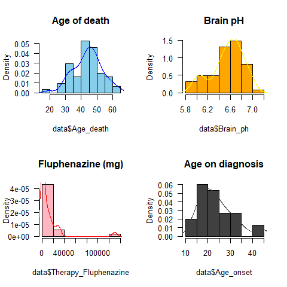
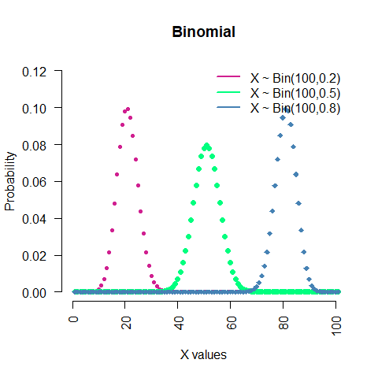
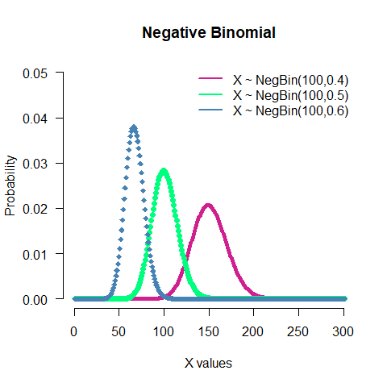
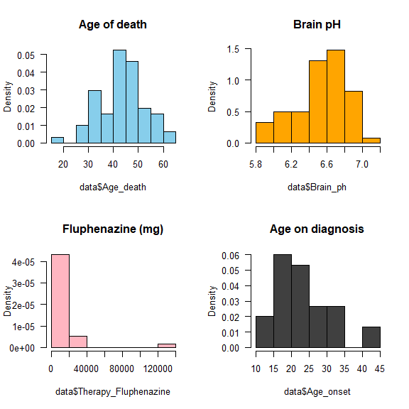
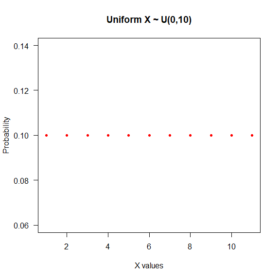
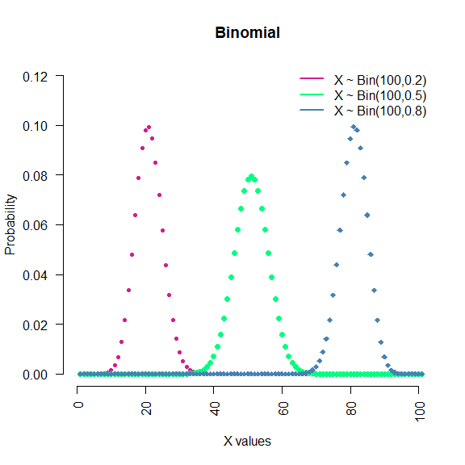

# Inference and Probability
{: .no_toc }


## Table of contents
{: .no_toc .text-delta }

1. TOC
{:toc}

---


**Inference** is the part of statistics that make inference about features from a sample to a population. 

A population is the **whole group you are interested in**, and the size doesn't matter! So, let's say I'm interested in the age of the students from the EVOP $2019$, the population is all the students attending the course. 
Descriptive statistics that are applied to populations, for example, the mean or standard deviation, are called parameters as they represent the whole population.

Because we cannot always use the whole population, we can use a sample. 
The properties of the sample are called *statistics*. 
Because we won't have the same sample all the time, there is an error and a variability included in every sampling. 
**Therefore we don't expect our sample to be the same and represent perfectly our population.**

## Probability
Probability is a measure of **how likely some event is to occur**. It's a number **between 0 (impossible) and 1 (certain)**.

Example: How likely is to flip a fair coin and get heads? We have Heads and Tails, so $2$ possible outcomes, and our desired outcome is head. So, flipping only one fair coin, we have the probability of $1/2$ of getting head.

A **distribution** is a mathematical **function** that can be thought of as providing the probability of occurrence of different possible outcomes in an experiment. 
For each value on our study, there is a probability associated with it. An easy way to visualise it is making a histogram, for example.


```r
par(mfrow = c(2,2))
hist(data$Age_death, col = "skyblue", freq = F, las = 1, main = 'Age of death')
hist(data$Brain_ph, col = "orange", freq = F, las = 1, main = 'Brain pH')
hist(data$Therapy_Fluphenazine, col = "lightpink", freq = F, las = 1, main = 'Fluphenazine (mg)')
hist(data$Age_onset, col = "gray25", freq = F, las = 1, main = 'Age on diagnosis')
```

<!-- -->

```r
par(mfrow = c(1,1))
```

Another way to plot the density function of a variable is to use the function `density()`.


```r
par(mfrow = c(2,2))

hist(data$Age_death, col = "skyblue", 
     freq = F, las = 1,
     main = 'Age of death')
lines(density(data$Age_death)$x, 
      density(data$Age_death)$y, 
      col = "blue")

hist(data$Brain_ph, col = "orange", 
     freq = F, las = 1, 
     main = 'Brain pH')
lines(density(data$Brain_ph)$x, 
      density(data$Brain_ph)$y, 
      col = "yellow")

hist(data$Therapy_Fluphenazine,
     col = "lightpink", freq = F,
     las = 1, main = 'Fluphenazine (mg)')
lines(density(data$Therapy_Fluphenazine, na.rm = T)$x, density(data$Therapy_Fluphenazine, na.rm = T)$y, col = "red")

hist(data$Age_onset, col = "gray25", 
     freq = F, las = 1, 
     main = 'Age on diagnosis')
lines(density(data$Age_onset, na.rm = T)$x, 
      density(data$Age_onset, na.rm = T)$y, 
      col = "gray25")
```

<!-- -->

```r
par(mfrow = c(1,1))
```


There is an infinity of distributions, some are very well known, and we will briefly talk about them.

Each distribution has its own characteristics, that gives its shape and form. For example, to describe a Normal distribution, we need its mean and variance.

### Discrete Distributions
If a variable can assume just integers numbers, or it's counting than its distribution is discrete. Some examples of discrete distributions are: **Discrete Uniform**, **Poisson**, **Bernoulli**, **Binomial** etc.

They can be simulated on R using the functions: `runif()`, `rbinom()`, `rnbinom()`, `rpois()`.

* **Uniform**: All the values inside this distribution have the same probability to happen. Notation: $X\sim U(a,b)$, $a\leqslant b$.


```r
seq(0, 10) %>% dunif(.,min = 0, max = 10) %>%
plot(.,  type = "p",
     las = 1, 
     col = "red", 
     pch = 20, 
     main = "Uniform X ~ U(0,10)",
     xlab = "X values", 
     ylab ="Probability")
```

<!-- -->


* **Bernoulli**: This is an outcome of *one* yes/no experiment. Notation: $X\sim Bernoulli(p)$.

* **Binomial**: This is conventionally interpreted as the number of *successes* in *n* Bernoulli experiments. Notation: $X\sim Bin(n,p)$.


```r
rbinom( n=3, size = 100, prob = 0.5)
```

```
## [1] 54 47 50
```


```r
seq(0, 100) %>% dbinom(.,100,0.2) %>%
plot(.,  type = "p",
     col = "violetred", 
     pch = 20, 
     main = "Binomial",
     xlab = "X values", 
     ylab ="Probability", 
     xlim = c(0,100), 
     ylim = c(0,0.12), axes = F )

seq(0, 100) %>% dbinom(.,100,0.5) %>%
lines(.,  type = "p",col = "springgreen", pch =16)

seq(0, 100) %>% dbinom(.,100,0.8) %>%
lines(.,  type = "p",col = "steelblue", pch =18)

legend("topright", c("X ~ Bin(100,0.2)", 
                     "X ~ Bin(100,0.5)", 
                     "X ~ Bin(100,0.8)"), 
       lwd = c(2,2,2), col = c("violetred", 
                               "springgreen", 
                               "steelblue"), 
       bty="n" )
axis(1, las = 2)
axis(2, las = 2)
```

<!-- -->

* **Negative Binomial**: This is conventionally interpreted as the *number of successes in a sequence of independent and identically distributed Bernoulli trials **before** a specified (non-random) number of failures (denoted r) occurs*. Notation: $X\sim NegBin(p,r)$.


```r
rnbinom(n = 3, size = 100, prob = 0.5)
```

```
## [1] 129 100  94
```


```r
seq(0, 300) %>% dnbinom(.,100,0.4) %>%
plot(., 
     type ="p",col = "violetred", pch =20, 
     main = "Negative Binomial", xlab = "X values", 
     ylab ="Probability", xlim = c(0,300), ylim = c(0,0.05), axes = F)

seq(0, 300) %>% dnbinom(.,100,0.5) %>%
lines(., type = "p",col = "springgreen", pch = 16)

seq(0, 300) %>% dnbinom(.,100,0.6) %>%
lines(., type = "p",col = "steelblue", pch = 18)
legend("topright", c("X ~ NegBin(100,0.4)",
                     "X ~ NegBin(100,0.5)",
                     "X ~ NegBin(100,0.6)"), 
       lwd = c(2,2,2), col = c("violetred", "springgreen", "steelblue"), bty="n" )
axis (1, las = 1)
axis (2, las = 2)
```

<!-- -->

* **Poisson**: Expresses the probability of a given *number of events occurring in a fixed interval of time and/or space* if these events occur with a known average rate and independently of the time since the last event. Notation: $X\sim P(\lambda)$.


```r
rpois(n = 3, lambda = 3)
```

```
## [1] 3 4 3
```


```r
seq(0, 100) %>% dpois(.,1) %>%
plot(.,
     type = "p",
     col = "violetred", 
     pch = 20, 
     main = "Poisson", 
     xlab = "X values", 
     ylab = "Probability", 
     xlim = c(0,15), 
     ylim = c(0,0.5),
     axes = F)

seq(0, 100) %>% dpois(.,2) %>%
lines(.,
      type = "p",
      col = "springgreen", 
      pch =16)

seq(0, 100) %>% dpois(.,5) %>%
lines(.,
      type = "p",
      col = "steelblue", 
      pch =18)

legend("topright", 
       c("X ~ P(1)", "X ~ P(2)", "X ~ P(5)"), 
       pch = c(20,16,18), 
       col = c("violetred", "springgreen", "steelblue"), 
       bty = "n")

axis (1, las = 1)
axis (2, las = 2)
```

<!-- -->


### Continuous Distributions

If a variable cannot assume just integers numbers than its distribution is continuous. One continuous distribution doesn't have a probability associated to a certain point, but to a range. Some examples of continuous distributions are: **Uniform**, **Gamma**, **Normal**, **Exponential** etc.

They can be simulated on R using `runif()`, `rexp()`, `rgamma()`, `rnorm()`.

* **Uniform**: All the intervals of the same length are equally probable. Notation: $X\sim U(a,b)$, $a\leqslant b$.


```r
runif(n = 3, min =  1, max = 10)
```

```
## [1] 6.194879 9.122172 3.220966
```


```r
seq(0, 1, length.out = 50) %>% dunif(.) %>%
plot(x = seq(0, 1, length.out = 50),
     y = ., 
     col = "violetred",
     type = "l",
     lwd = 2, 
     las = 1,
     main = "Uniform", 
     xlab = "X values", 
     ylab ="Density", 
     xlim = c(-1,5), 
     ylim = c(0,1), 
     xaxs = "i")

seq(0, 4, length.out = 50) %>% dunif(., min = 0, max = 4) %>%
lines(x = seq(0, 4, length.out = 50),
      y = ., 
      col = "springgreen",
      lwd = 2)

seq(1, 3, length.out = 50) %>% dunif(., min = 1, max = 3) %>%
lines(x = seq(1, 3, length.out = 50),
      y = ., 
      col = "steelblue",
      lwd = 2)

legend("topright", 
       c("X ~ U(0,1)", "X ~ U(0,4)", "X ~ U(1,3)"), 
       lwd = 2,
       col = c("violetred", "springgreen", "steelblue"), 
       bty = "n")
```

<!-- -->

* **Exponential**: It is often used to model the **time elapsed between events**. It also is independent of the last step. Notation: $X\sim Exp(\lambda)$.


```r
rexp(n = 3, rate = 3)
```

```
## [1] 0.5971039 0.7919187 0.2318062
```


```r
seq(0, 100, length.out = 500) %>% dexp(., 3) %>%
plot(x = seq(0, 100, length.out = 500),
     y = .,
     col = "violetred",
     type = "l",
     lwd = 2, 
     las = 1,
     main = "Exponencial", 
     xlab = "X values", 
     ylab ="Density", 
     xlim = c(0,8), 
     ylim = c(0,3), 
     xaxs = "i")

seq(0, 100, length.out = 500) %>% dexp(.,1) %>%
lines(x = seq(0, 100, length.out = 500),
      y = .,
      col = "springgreen", 
      lwd = 2)

seq(0, 100, length.out = 500) %>% dexp(.,0.5) %>%
lines(x = seq(0, 100, length.out = 500),
      y = ., 
      col = "steelblue", 
      lwd = 2)

legend("topright", 
       c("X ~ Exp(0.5)", "X ~ Exp(1.0)", "X ~ Exp(3.0)"),
       col = c("steelblue", "springgreen", "violetred"),
       lwd = 2,
       bty = "n")
```

<!-- -->

* **Gamma**: Gamma is used to model **time to death or failure**. Notation: $X\sim G(\alpha,\beta)$, $\alpha,\beta \gt 0$.


```r
rgamma(n = 3, shape = 3, scale =  3)
```

```
## [1]  4.770358 12.625383 15.551681
```


```r
seq(0, 100, length.out = 500) %>% dgamma(.,10,2) %>%
plot(x = seq(0, 100, length.out = 500),
     y = .,
     col = "violetred",
     lwd = 2,
     las = 1,
     type = "l",
     main = "Gamma", 
     xlab = "X values", 
     ylab ="Density", 
     xlim = c(0,20), 
     ylim = c(0,0.8), 
     xaxs = "i")

seq(0, 100, length.out = 500) %>% dgamma(.,1.5,1) %>%
lines(x = seq(0, 100, length.out = 500),
      y = ., 
      col = "springgreen", 
      lwd = 2)

seq(0, 100, length.out = 500) %>% dgamma(.,5,3) %>%
lines(x = seq(0, 100, length.out = 500),
      y = ., 
      col = "steelblue", 
      lwd = 2)

seq(0, 100, length.out = 500) %>% dgamma(.,8,1) %>%
lines(x = seq(0, 100, length.out = 500),
      y = ., 
      col = "orange", 
      lwd = 2)

seq(0, 100, length.out = 500) %>% dgamma(.,2,0.4) %>%
lines(x = seq(0, 100, length.out = 500),
      y = .,
      col = "salmon", 
      lwd = 2)

legend("topright", c("X ~ G(10,2)",
                     "X ~ G(1,0.5)",
                     "X ~ G(5,3)", 
                     "X ~ G(8,1)", 
                     "X ~ G(2,0.4)"),
       lwd = 2,
       col = c("violetred", "springgreen", "steelblue", "orange", "salmon"), 
       bty = "n")
```

<!-- -->

* **Normal**: It is one the most important distributions, mainly because of the central limit theorem, which states that averages of random variables independently drawn from independent distributions converge in distribution to the normal, that is, become normally distributed when the number of random variables is sufficiently large. The normal distribution is symmetric about its mean, the mean is the same as median and mode. Notation: $X\sim N(\mu,\sigma)$.


```r
rnorm(n=3, mean = 0, sd = 1)
```

```
## [1]  1.5535167632 -1.0875741361 -0.0009670867
```


```r
seq(-10, 10, length.out = 500) %>% dnorm(.) %>%
plot(x = seq(-10, 10, length.out = 500), y = ., 
     col = "violetred",
     lwd = 2, 
     type = "l",
     main = "Normal", 
     xlab = "X values", 
     ylab = "Density", 
     xlim = c(-10,10), 
     #ylim = c(0,1), 
     xaxs = "i")

seq(-10, 10, length.out = 500) %>% dnorm(.,2,2) %>%
lines(x = seq(-10, 10, length.out = 500),
      y = .,
      col = "springgreen", 
      lwd = 2)

seq(-10, 10, length.out = 500) %>% dnorm(.,0,4) %>%
lines(x = seq(-10, 10, length.out = 500),
      y = .,
      col = "steelblue", 
      lwd = 2)

legend("topright", c("X ~ N(0,1)",
                     "X ~ N(2,2)",
                     "X ~ N(0,4)"),
       lwd = 2,
       col = c("violetred", "springgreen", "steelblue"), 
       bty = "n")
```

<!-- -->

