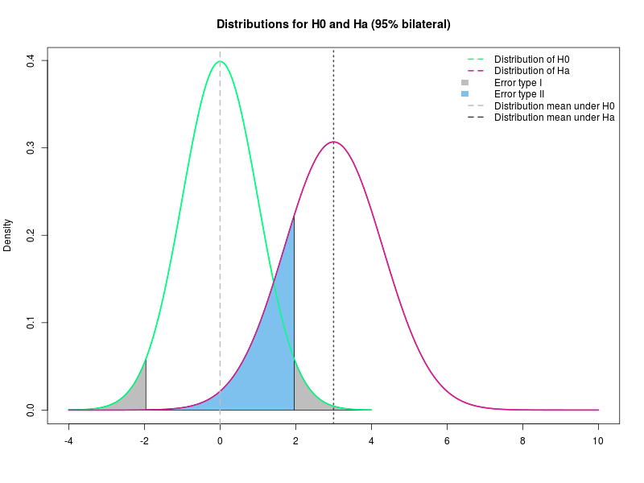
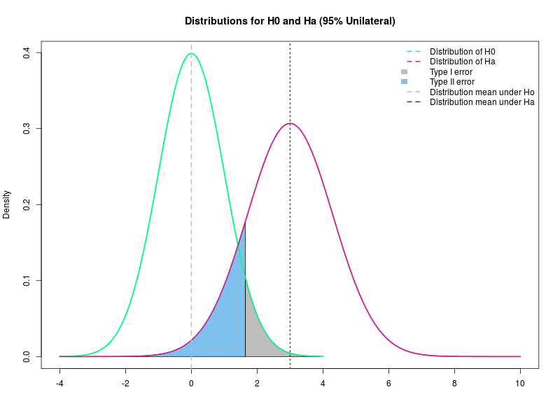

## What is statistics?
*Statistics* is the part of the scientific method that aims to collect, reduce, analyse and model real data. Statistics helps the analyse and presentation of data, and is also involved with the design of experiments, planning and defining how to collect the data in order to achieve results minimizing errors.

In the end, the statistical analysis should be able to tell us something concrete about the sample that we are studying and allow us to make inferences towards a population.

```{r, echo=FALSE, results='markup'}
x = LETTERS[1:20]
y = LETTERS[1:4]
z = LETTERS[5:7]
w = LETTERS[10:13]

fit = eulerr::euler(list(Population = x, Sample1 = y, Sample2 = z, Sample3 = w)) 
cols = c('gray', 'blue', 'orange', 'violetred')
cols = adjustcolor(cols, alpha.f = 0.3)
plot(fit, fill = cols)
```

Statistics is normally divided into two main methods:
*Descriptive statistics* and *Inferential statistics*.

The descriptive analysis gives an *overview* about the sample and the inferential analysis tests hypothesis about the population.

Before we can understand **what** the data is revealing us, we have to be able to split the variables in its correct category. 

## Types of variables
The variables can be classified into two main groups:

1. *Qualitative* or *Categorical*
  i. *Nominal* (There are no order for the labels)
    + Eg. Country, Gender, Brand of preference, Sides of a coin.
  ii. *Ordinal* (There are an order on the labels)
    + Eg. Degree, State of a disease.

2. *Quantitative* or *Numerical*
  i. *Discrete* (Countable)
    + Eg. The number of kids, Number of births/deaths.
  ii. *Continuous*
    + Eg. Temperature, Age.

In this course, we will use as an example, the data from GSE$5388$, a data set containing data from patients with Bipolar Disorder. In our dataset we have some phenotypic data, and the log transform of the gene expression of some genes.

```{r}
data = read.csv("Course_2019/Pheno_DE.csv", header = T, row.names = 1)

data[1:5,1:10]

names(data)
```

### Exercise
1. Define the type of each variable in our data set. 

## Descriptive Analysis
### Frequency Tables
Frequency tables can be used for all kinds of variables, however, it's preferable to be used for the *categorical*. However, if you use it for numerical data, the values of the variable have to be divided into *ranges*.

To get an absolute frequency table using R, 
the easiest way is by using the function `table()`, 
and for a relative frequency table `prop.table()`.

```{r}

table(data$Gender) # Creates an absolute frequency table of Gender
table(data$Status)
require(magrittr) # Allows using pipe inside R
table(data$Gender) %>% # Pipes the absolute freq. table into
  prop.table()         # a relative freq. table
```

What happens if we ask for a `prop.table()` on an object that is not a table?

```{r}
 # prop.table(data$Gender)
```

The `table()` function also allows us to create cross-tables. For that, the input is two variables.
```{r}
table(data$Gender, data$Status)
table(data$Gender, data$Status) %>% 
  prop.table(.) %>% 
  round(.,2)
```

Normally `barplot()` is used to represent visually a frequency table.

```{r}
table(data$Gender, data$Status) %>% 
  barplot(., beside = TRUE, 
          legend.text = TRUE, 
          col = c('salmon','turquoise'), 
          args.legend = list(x = 'topleft',
                             bty = 'n'),
          ylim = c(0,25),
          las = 1)
```


### Central tendency measures
The **central tendency measures** attempts to summarise/describe the dataset by its central position. 
The *mean*, *median* and *mode* are examples of central measurements.

The **five-number summary** is a set of descriptive statistics that provide information about a dataset. 
It consists of five quartiles:

1. $Q_0$ the lowest value of the sample, aka **Minimum**
1. $Q_1$ $25\%$ of the sample, aka **lower quantile**
1. $Q_2$ $50\%$ of the sample, aka **median**
1. $Q_3$ $75\%$ of the sample, aka **upper quantile**
1. $Q_4$ the biggest value of the sample, aka **Maximum**

The functions `summary()` and `fivenum()` returns the five-number summary. They are a bit different how they calculate the $1^{st}$ and $3^{rd}$ quantiles.
`summary()` calculates the average of the two numbers, if even, `fivenum()` returns the minimum. 

```{r}
### The function summary will give you an overview of the full data set if you want to!
summary(data)
```

```{r}
### or just the variable you want.
summary(data$Age_death)

fivenum(data$Age_death)
###  (minimum, lower-hinge, median, upper-hinge, maximum)
```

The graphical representation of the summary is the `boxplot()`.

```{r}
boxplot(data$Age_onset, 
        las = 2, 
        pch = 4,
        col = 'salmon')
```

If we are interested in the summary **by** condition, we can use the function `by()`.

```{r}
by(data, data$Status, 
   FUN = summary)
```

And the `boxplot()`:

```{r}
boxplot(data$Age_death ~ data$Status, 
        las = 1, pch = 4, 
        col = c('salmon', 'turquoise'))
```


#### Mean
It is calculated by taking the sum of the values and dividing by the total number of values of the data. 
The function `mean()` can be used to calculate the average.


```{r}
mean(data$Age_death)
```

**Interpretation**: On average, the age of death of death in this study was `r mean(data$Age_death)`.


You can also use `colMeans()` and `rowMeans()` to compute the mean of columns and rows.

```{r}
colMeans(data[,c(17:28)], na.rm = T)
```

```{r}
rowMeans(data[,17:28], na.rm = T)
```

#### Median
It is the value that divides your dataset in the **middle**, the function`median()` computes it in R.

```{r}
median(data$Age_death)
```

**Interpretation**: The mid-age of death in this study was `r median(data$Age_death)`. This means that this is the value that divides the data in half.

Note! The median is not always the same as the mean!

```{r}
# attach(data)
plot((density(data$Age_death))$x,(density(data$Age_death))$y, 
     type = "l", 
     xlab = "Age of death",
     ylab = "Density", 
     las = 2, 
     axes = F, 
     col = "violet", 
     lwd = 3, 
     col.lab = "steelblue")
axis(1, 
     at = seq(from = (round(min(data$Age_death))-2), by = 2, to = (2+round(max(data$Age_death)))), 
     col = "gray75",  
     col.axis = "gray75")
axis(2, 
     las = 2, 
     col = "gray75", 
     col.ticks = "gray75", 
     col.axis = "gray75")
abline(v = median(data$Age_death), 
       col = "salmon", 
       lwd = 2)
abline(v = mean(data$Age_death), 
       col = "steelblue", 
       lwd = 2)
legend("topright", 
       c(paste("Median", round(median(data$Age_death),2)), paste("Mean", round(mean(data$Age_death),2))), 
       col = c("salmon", "steelblue"), 
       lwd = 2, 
       bty = "n")
```

#### Mode

The mode is the value that appears **the most on a variable**. 
It's the *fashion* of the variable, the one that almost everyone is wearing. 
And sometimes there might exist more than one mode, but we won't deal with it here.

Unfortunately, there is no function on R to compute the mode. But we already know how to construct tables and functions. So, let's create our own function.

```{r}
Mode = function(VAR){
    actual_mode <- table(VAR) 
    NAME = names(actual_mode)[actual_mode == max(actual_mode)]
    VAL = actual_mode[actual_mode == max(actual_mode)]
    return( data.frame(Value = NAME, Frequency = VAL))
}
```


```{r}
Mode(data$Age_onset)
```

**Interpretation**: The most common age where people were diagnosed with bipolar disorder was `r Mode(data$Age_onset)$Value` years.


### Dispersion measures
The dispersion refers to *how the values are spread* from the central data. It is as important as the central tendency values. Some of them are *Range*, *IQR*, *Variance* and *standard deviation*.

#### Range
The range is the difference between the largest and the smallest value of a variable.
The function `range()` returns the minimum and maximum values, to have the range we have to use the function `diff()`.

```{r}
range(data$Age_death) %>% 
  diff(.)
```

**Interpretation**: The difference (or the range) among the ages in our study was `r range(data$Age_death) %>% diff(.)` years.

#### Interquartile range (IQR)
Is the difference between the third and the first quartiles. It's used to read and draw the boxplots.
On R we can use the function IQR()
```{r}
IQR(data$Age_death)
```


**Interpretation**: The Interval interquantile is `r Mode(data$Age_onset)$Value`. This value in general used to interpret the `boxplot()`.

```{r}
boxplot(data$Age_death , 
        col = c ("springgreen"), 
        ylab = "Age of death - years", 
        las = 2)
quantile(data$Age_death)
```


#### Variance
Variance is the expectation of the squared deviation of a random variable from its mean. In other words, the variance is how far the values are from the mean. We can calculate it using the function `var()`.

```{r}
var(data$Age_death)
```

**Interpretation**: The age of the individuals in our study deviates from the mean in `r var(data$Age_death)` years$^2$ (quadratic scale).
However, it is quite hard to make interpretations in years$^2$.

#### Standard deviation (SD)
Is how the values are spread around the mean. It is given by the square root of the variance. A low standard deviation indicates that the data points tend to be close to the mean, while a high standard deviation indicates that the data points are spread out over a wider range of values. To compute the SD using R we can use the function `sd()`.
```{r}
sd(data$Age_death)
sqrt(var(data$Age_death))
```

**Interpretation**: The age of the individuals in our study deviates from the mean in `r sd(data$Age_death)` years (data scale).

#### Coefficient of variation
The coefficient of variation is the sd divided by the mean. In chemistry is widely used to express the precision and repeatability of an experiment. Normally it is expressed as a percentage. The CV aims to describe the dispersion of the variable in a way that does not depend on the variable's measurement unit. The higher the CV, the greater the dispersion in the variable.

It's also used to compare the variation of variables that are not on the same scale.

The R doesn't have a function to compute it, but we can easily create our own.

```{r}
sd(sd(data$Age_death))/mean(sd(data$Age_death))*100
```


```{r}
CV <- function(VAR){
      (sd(VAR, na.rm = T)/mean(VAR, na.rm = T))*100
      }
```

```{r}
CV(sd(data$Age_death))
```


### Exercises
1. Make absolute and relative frequency tables for the variables: Gender and Status. 

1. Check how many people that suffered from Bipolar Disorder committed suicide. Visualise it using a barplot. 

2. Compute and make the correct interpretations for the mean, median, IQR, standard deviation, variance and CV for all the quantitative variables. Tipp: You can create a function for that!

3. Compute and make the correct interpretations for the mean, median, IQR, standard deviation, variance and CV for all the numeric variables only for Males. Tipp: Use the function created before on a subset of the dataset.

4. Compute and make the correct interpretations for the mean, median, IQR, standard deviation, variance and CV for all the quantitative variables for both conditions separately.


## Inference and Probability
**Inference** is the part of statistics that make inference about features from a sample to a population. 

A population is the **whole group you are interested in**, and the size doesn't matter! So, let's say I'm interested in the age of the students from the EVOP $2019$, the population is all the students attending the course. 
Descriptive statistics that are applied to populations, for example, the mean or standard deviation, are called parameters as they represent the whole population.

Because we cannot always use the whole population, we can use a sample. 
The properties of the sample are called *statistics*. 
Because we won't have the same sample all the time, there is an error and a variability included in every sampling. 
**Therefore we don't expect our sample to be the same and represent perfectly our population.**

### Probability
Probability is a measure of **how likely some event is to occur**. It's a number **between 0 (impossible) and 1 (certain)**.

Example: How likely is to flip a fair coin and get heads? We have Heads and Tails, so $2$ possible outcomes, and our desired outcome is head. So, flipping only one fair coin, we have the probability of $1/2$ of getting head.

A **distribution** is a mathematical **function** that can be thought of as providing the probability of occurrence of different possible outcomes in an experiment. 
For each value on our study, there is a probability associated with it. An easy way to visualise it is making a histogram, for example.

```{r}
par(mfrow = c(2,2))
hist(data$Age_death, col = "skyblue", freq = F, las = 1, main = 'Age of death')
hist(data$Brain_ph, col = "orange", freq = F, las = 1, main = 'Brain pH')
hist(data$Therapy_Fluphenazine, col = "lightpink", freq = F, las = 1, main = 'Fluphenazine (mg)')
hist(data$Age_onset, col = "gray25", freq = F, las = 1, main = 'Age on diagnosis')
par(mfrow = c(1,1))
```

Another way to plot the density function of a variable is to use the function `density()`.

```{r}
par(mfrow = c(2,2))

hist(data$Age_death, col = "skyblue", 
     freq = F, las = 1,
     main = 'Age of death')
lines(density(data$Age_death)$x, 
      density(data$Age_death)$y, 
      col = "blue")

hist(data$Brain_ph, col = "orange", 
     freq = F, las = 1, 
     main = 'Brain pH')
lines(density(data$Brain_ph)$x, 
      density(data$Brain_ph)$y, 
      col = "yellow")

hist(data$Therapy_Fluphenazine,
     col = "lightpink", freq = F,
     las = 1, main = 'Fluphenazine (mg)')
lines(density(data$Therapy_Fluphenazine, na.rm = T)$x, density(data$Therapy_Fluphenazine, na.rm = T)$y, col = "red")

hist(data$Age_onset, col = "gray25", 
     freq = F, las = 1, 
     main = 'Age on diagnosis')
lines(density(data$Age_onset, na.rm = T)$x, 
      density(data$Age_onset, na.rm = T)$y, 
      col = "gray25")
par(mfrow = c(1,1))
```


There is an infinity of distributions, some are very well known, and we will briefly talk about them.

Each distribution has its own characteristics, that gives its shape and form. For example, to describe a Normal distribution, we need its mean and variance.

#### Discrete Distributions
If a variable can assume just integers numbers, or it's counting than its distribution is discrete. Some examples of discrete distributions are: **Discrete Uniform**, **Poisson**, **Bernoulli**, **Binomial** etc.

They can be simulated on R using the functions: `runif()`, `rbinom()`, `rnbinom()`, `rpois()`.

* **Uniform**: All the values inside this distribution have the same probability to happen. Notation: $X\sim U(a,b)$, $a\leqslant b$.

```{r}
seq(0, 10) %>% dunif(.,min = 0, max = 10) %>%
plot(.,  type = "p",
     las = 1, 
     col = "red", 
     pch = 20, 
     main = "Uniform X ~ U(0,10)",
     xlab = "X values", 
     ylab ="Probability")
```


* **Bernoulli**: This is an outcome of *one* yes/no experiment. Notation: $X\sim Bernoulli(p)$.

* **Binomial**: This is conventionally interpreted as the number of *successes* in *n* Bernoulli experiments. Notation: $X\sim Bin(n,p)$.

```{r} 
rbinom( n=3, size = 100, prob = 0.5)
```


```{r} 
seq(0, 100) %>% dbinom(.,100,0.2) %>%
plot(.,  type = "p",
     col = "violetred", 
     pch = 20, 
     main = "Binomial",
     xlab = "X values", 
     ylab ="Probability", 
     xlim = c(0,100), 
     ylim = c(0,0.12), axes = F )

seq(0, 100) %>% dbinom(.,100,0.5) %>%
lines(.,  type = "p",col = "springgreen", pch =16)

seq(0, 100) %>% dbinom(.,100,0.8) %>%
lines(.,  type = "p",col = "steelblue", pch =18)

legend("topright", c("X ~ Bin(100,0.2)", 
                     "X ~ Bin(100,0.5)", 
                     "X ~ Bin(100,0.8)"), 
       lwd = c(2,2,2), col = c("violetred", 
                               "springgreen", 
                               "steelblue"), 
       bty="n" )
axis(1, las = 2)
axis(2, las = 2)
```

* **Negative Binomial**: This is conventionally interpreted as the *number of successes in a sequence of independent and identically distributed Bernoulli trials **before** a specified (non-random) number of failures (denoted r) occurs*. Notation: $X\sim NegBin(p,r)$.

```{r} 
rnbinom(n = 3, size = 100, prob = 0.5)
```

```{r}  

seq(0, 300) %>% dnbinom(.,100,0.4) %>%
plot(., 
     type ="p",col = "violetred", pch =20, 
     main = "Negative Binomial", xlab = "X values", 
     ylab ="Probability", xlim = c(0,300), ylim = c(0,0.05), axes = F)

seq(0, 300) %>% dnbinom(.,100,0.5) %>%
lines(., type = "p",col = "springgreen", pch = 16)

seq(0, 300) %>% dnbinom(.,100,0.6) %>%
lines(., type = "p",col = "steelblue", pch = 18)
legend("topright", c("X ~ NegBin(100,0.4)",
                     "X ~ NegBin(100,0.5)",
                     "X ~ NegBin(100,0.6)"), 
       lwd = c(2,2,2), col = c("violetred", "springgreen", "steelblue"), bty="n" )
axis (1, las = 1)
axis (2, las = 2)
```

* **Poisson**: Expresses the probability of a given *number of events occurring in a fixed interval of time and/or space* if these events occur with a known average rate and independently of the time since the last event. Notation: $X\sim P(\lambda)$.

```{r}  
rpois(n = 3, lambda = 3)
```

```{r} 
seq(0, 100) %>% dpois(.,1) %>%
plot(.,
     type = "p",
     col = "violetred", 
     pch = 20, 
     main = "Poisson", 
     xlab = "X values", 
     ylab = "Probability", 
     xlim = c(0,15), 
     ylim = c(0,0.5),
     axes = F)

seq(0, 100) %>% dpois(.,2) %>%
lines(.,
      type = "p",
      col = "springgreen", 
      pch =16)

seq(0, 100) %>% dpois(.,5) %>%
lines(.,
      type = "p",
      col = "steelblue", 
      pch =18)

legend("topright", 
       c("X ~ P(1)", "X ~ P(2)", "X ~ P(5)"), 
       pch = c(20,16,18), 
       col = c("violetred", "springgreen", "steelblue"), 
       bty = "n")

axis (1, las = 1)
axis (2, las = 2)
```


#### Continuous distributions

If a variable cannot assume just integers numbers than its distribution is continuous. One continuous distribution doesn't have a probability associated to a certain point, but to a range. Some examples of continuous distributions are: **Uniform**, **Gamma**, **Normal**, **Exponential** etc.

They can be simulated on R using `runif()`, `rexp()`, `rgamma()`, `rnorm()`.

* **Uniform**: All the intervals of the same length are equally probable. Notation: $X\sim U(a,b)$, $a\leqslant b$.

```{r}
runif(n = 3, min =  1, max = 10)
```

```{r} 
seq(0, 1, length.out = 50) %>% dunif(.) %>%
plot(x = seq(0, 1, length.out = 50),
     y = ., 
     col = "violetred",
     type = "l",
     lwd = 2, 
     las = 1,
     main = "Uniform", 
     xlab = "X values", 
     ylab ="Density", 
     xlim = c(-1,5), 
     ylim = c(0,1), 
     xaxs = "i")

seq(0, 4, length.out = 50) %>% dunif(., min = 0, max = 4) %>%
lines(x = seq(0, 4, length.out = 50),
      y = ., 
      col = "springgreen",
      lwd = 2)

seq(1, 3, length.out = 50) %>% dunif(., min = 1, max = 3) %>%
lines(x = seq(1, 3, length.out = 50),
      y = ., 
      col = "steelblue",
      lwd = 2)

legend("topright", 
       c("X ~ U(0,1)", "X ~ U(0,4)", "X ~ U(1,3)"), 
       lwd = 2,
       col = c("violetred", "springgreen", "steelblue"), 
       bty = "n")
```

* **Exponential**: It is often used to model the **time elapsed between events**. It also is independent of the last step. Notation: $X\sim Exp(\lambda)$.

```{r}  
rexp(n = 3, rate = 3)
```

```{r}
seq(0, 100, length.out = 500) %>% dexp(., 3) %>%
plot(x = seq(0, 100, length.out = 500),
     y = .,
     col = "violetred",
     type = "l",
     lwd = 2, 
     las = 1,
     main = "Exponencial", 
     xlab = "X values", 
     ylab ="Density", 
     xlim = c(0,8), 
     ylim = c(0,3), 
     xaxs = "i")

seq(0, 100, length.out = 500) %>% dexp(.,1) %>%
lines(x = seq(0, 100, length.out = 500),
      y = .,
      col = "springgreen", 
      lwd = 2)

seq(0, 100, length.out = 500) %>% dexp(.,0.5) %>%
lines(x = seq(0, 100, length.out = 500),
      y = ., 
      col = "steelblue", 
      lwd = 2)

legend("topright", 
       c("X ~ Exp(0.5)", "X ~ Exp(1.0)", "X ~ Exp(3.0)"),
       col = c("steelblue", "springgreen", "violetred"),
       lwd = 2,
       bty = "n")
```

* **Gamma**: Gamma is used to model **time to death or failure**. Notation: $X\sim G(\alpha,\beta)$, $\alpha,\beta \gt 0$.

```{r} 
rgamma(n = 3, shape = 3, scale =  3)
```

```{r}  
seq(0, 100, length.out = 500) %>% dgamma(.,10,2) %>%
plot(x = seq(0, 100, length.out = 500),
     y = .,
     col = "violetred",
     lwd = 2,
     las = 1,
     type = "l",
     main = "Gamma", 
     xlab = "X values", 
     ylab ="Density", 
     xlim = c(0,20), 
     ylim = c(0,0.8), 
     xaxs = "i")

seq(0, 100, length.out = 500) %>% dgamma(.,1.5,1) %>%
lines(x = seq(0, 100, length.out = 500),
      y = ., 
      col = "springgreen", 
      lwd = 2)

seq(0, 100, length.out = 500) %>% dgamma(.,5,3) %>%
lines(x = seq(0, 100, length.out = 500),
      y = ., 
      col = "steelblue", 
      lwd = 2)

seq(0, 100, length.out = 500) %>% dgamma(.,8,1) %>%
lines(x = seq(0, 100, length.out = 500),
      y = ., 
      col = "orange", 
      lwd = 2)

seq(0, 100, length.out = 500) %>% dgamma(.,2,0.4) %>%
lines(x = seq(0, 100, length.out = 500),
      y = .,
      col = "salmon", 
      lwd = 2)

legend("topright", c("X ~ G(10,2)",
                     "X ~ G(1,0.5)",
                     "X ~ G(5,3)", 
                     "X ~ G(8,1)", 
                     "X ~ G(2,0.4)"),
       lwd = 2,
       col = c("violetred", "springgreen", "steelblue", "orange", "salmon"), 
       bty = "n")

```

* **Normal**: It is one the most important distributions, mainly because of the central limit theorem, which states that averages of random variables independently drawn from independent distributions converge in distribution to the normal, that is, become normally distributed when the number of random variables is sufficiently large. The normal distribution is symmetric about its mean, the mean is the same as median and mode. Notation: $X\sim N(\mu,\sigma)$.

```{r}  
rnorm(n=3, mean = 0, sd = 1)

```


```{r}  
seq(-10, 10, length.out = 500) %>% dnorm(.) %>%
plot(x = seq(-10, 10, length.out = 500), y = ., 
     col = "violetred",
     lwd = 2, 
     type = "l",
     main = "Normal", 
     xlab = "X values", 
     ylab = "Density", 
     xlim = c(-10,10), 
     #ylim = c(0,1), 
     xaxs = "i")

seq(-10, 10, length.out = 500) %>% dnorm(.,2,2) %>%
lines(x = seq(-10, 10, length.out = 500),
      y = .,
      col = "springgreen", 
      lwd = 2)

seq(-10, 10, length.out = 500) %>% dnorm(.,0,4) %>%
lines(x = seq(-10, 10, length.out = 500),
      y = .,
      col = "steelblue", 
      lwd = 2)

legend("topright", c("X ~ N(0,1)",
                     "X ~ N(2,2)",
                     "X ~ N(0,4)"),
       lwd = 2,
       col = c("violetred", "springgreen", "steelblue"), 
       bty = "n")

```

### Hypothesis testing
A statistical hypothesis is an assumption about a population parameter. This assumption may or may not be true.
In traditional / frequentist Statistics there are two different statistical hypotheses:

* **Null hypothesis**: denoted by $H_0$ or H0, is usually the hypothesis that sample observations result **purely from chance**. In general, it is an equality assumption.

* **Alternative hypothesis**: denoted by $H_1$ or $H_a$, is the hypothesis that sample observations are influenced by some non-random cause. In general, it is inequality, superiority or inferiority.

There are two outcomes from Hypothesis testing:

1. **you reject the null hypothesis**;
1. **you fail to reject the null hypothesis**. We never say that we accepted the null hypothesis. Failure to reject means that the data are not sufficiently persuasive for us to prefer the alternative hypothesis over the null hypothesis.

#### Steps to test a null hypothesis

1. **State the hypotheses**. This involves stating the null and alternative hypotheses. The hypotheses are stated in such a way that they are mutually exclusive. That is, if one is true, the other must be false.
2. **Define the analysis plan**. The analysis plan describes how to use sample data to evaluate the null hypothesis. The evaluation often focuses on a single test statistic.
3. **Analyse sample data**. Find the value of the test statistic (mean score, proportion, t statistic, z-score, etc.) described in the analysis plan. At this point, you also determine your significance level.
4. **Make the interpretation of the results**. Apply the decision rule described in the analysis plan. If the value of the test statistic is improbable, based on the null hypothesis, reject the null hypothesis.

The hypothesis is measured using a statistic, that, in other words, is a probabilistic way to measure it.

* **Example**: We want to know if the two groups in our example are different. How different, in which sense? Let's say mean of ages. If they are not the same under H0, it means, the mean of both groups is different, the probability of having the same mean is small.

Again. We have 4 steps:

1. What is the hypothesis?
1. What is the statistics?
1. What is the significance level?
1. Results? Interpretation.

#### Type I and type II errors
Two types of errors are possible are possible from testing a hypothesis: **type I** and **type II**. 
The risks of these two errors are inversely related and determined by the **level of significance** and the **power of the test**.

* **Type I error**: occurs when the **null hypothesis is rejected when it is true**. The probability of committing a Type I error is called the significance level. This probability is also called alpha and is often denoted by $\alpha$.

* **Type II error**: occurs when the **null hypothesis is failed to be rejected when it is false**. The probability of committing a Type II error is called Beta and is often denoted by $\beta$. The probability of not committing a Type II error is called the Power of the test.

| Error types                         |                | Null hypothesis (H0) is                                   |                                                           |
|-------------------------------------|----------------|-----------------------------------------------------------|-----------------------------------------------------------|
|                                     |                | TRUE                                                      | FALSE                                                     |
| Decision About Null Hypothesis (H0) | Reject         | Type I error (False Positive) Probability = $\alpha$      | Correct inference (True Negative) Probability = $1 - \beta$ |
|                                     | Fail to reject | Correct inference (True Positive) Probability = $1 - \alpha$ | Type II error (False Negative) Probability = $\beta$      |






#### p-value
The **p-value** is defined as the probability of obtaining a result equal to or *more extreme* than what was observed, *when the null hypothesis is true*. In other words, it is *the strength of evidence in support of a null hypothesis*.

**Note: Because p-value is a probability it lies in the interval $(0,1)$.**

#### Confidence Intervals
Suppose we want to estimate an actual population mean. However, we cannot compute the population mean, right? What we have is a random sample from a population. Therefore, we have a **range where the real mean is, this range is called Confidence Interval**.

mean - value < $\mu$ < mean + value

This value depends on the confidence we want, also depends on the distribution chosen to describe the data.
For the **Normal** we have the probability for the desired quantile (1.96 for 5% significance) * the standard deviation of the sample/sqrt (size of the sample).

$IC = \bar{x} \pm 1.96 \times sd(x)/ \sqrt{n}$

```{r}  
normal = rnorm(1000, 0, 1)
hist(normal, 
     las = 1, 
     col = rainbow(10),
     xlim = c(-4,4),
     main = "Histogram",
     xlab = "Normal Variable")

mean(normal)

```

* Example: Suppose that we have 100 random samples (of size n = 25) that came from a certain population (of size N = 1000). In approximately 95% of the cases, the real mean will lie inside the estimated confidence interval.

```{r}
CI = function(data, sign=0.05, two.tails = T,size=25, n){
  CI = matrix(NA, nrow = n, ncol = 3)
  sign = ifelse(two.tails == T, sign/2, sign)
  for (i in 1:n){
    x =  sample(data, size = size)
    CI[i,1] = mean(x) 
    CI[i,2] = mean(x) + qnorm(sign) * sd(x)/sqrt(size)
    CI[i,3] = mean(x) - qnorm(sign) * sd(x)/sqrt(size)
  }
  CI = as.data.frame(CI)
  names(CI) = c("mean", "CI.lower", "CI.upper")
  return(CI)
}

```


```{r}  
CIs = CI(data = normal, n = 100)

plot(CIs$mean ~ c(1:100),
     xlim = c(1,100),
     ylim = c(min(c(CIs$CI.lower, CIs$CI.upper)), 
              max(CIs$CI.lower, CIs$CI.upper)),xlab='',
     ylab='X', 
     main=paste('Confidence Interval for mean, n = 25'),
     col='grey75',pch=20, bg = "transparent", las = 1, axes = FALSE)
axis(1)
axis(2, las = 1)
cor = ifelse(mean(normal) < CIs$CI.lower | mean(normal) > CIs$CI.upper,  "red", "grey30")
arrows(c(1:100),CIs$CI.lower,c(1:100),CIs$CI.upper,code=3,length=0.2,angle=90,col=cor)
abline(h=mean(normal), lwd= 2, lty=2, col= "purple")

```

#### Testing normality
Tests for normality are mainly used to check if a particular **variable follows a Normal distribution**. It is useful mainly because the **parametric tests require normality**.

A good test is the Shapiro Wilks test, on R can be used by the function `shapiro.test()`.

**Hypothesis:**

$H_0$: The variable X follows a Normal distribution

$H_a$: The variable X does not follow a Normal distribution

Notice that using the `shapiro.test()` we want the null hypothesis ($H_0$) to be true, so, we want high p-values.

We can also use `qqnorm()` to verify the quantiles of our distribution.

Example 1. Verify if the Age follows a Normal distribution.

```{r} 
shapiro.test(data$Age_death)

```
```{r} 
par(mfrow = c(1,2))

qqnorm(data$Age_death, pch = 16)
qqline(data$Age_death, col = 2)
boxplot(data$Age_death)
```

1. What is the hypothesis?
    * $H_0$: The Age follows a Normal distribution
    * $H_a$: The Age does not follow a Normal distribution
1. What is the statistics?
    * W.
1. What is the significance level?
    * 0.05
1.  Results?
    * p-value = ``r shapiro.test(data$Age_death)$p.value``

**Interpretation**: The p-value is higher than 0.05, we assume that the Age of death follows a Normal distribution.


#### Testing variance
F-Test and Bartlett-Test are used to test if two variances are statistically equal.
Both tests assume that your variable has a Normal distribution.
Comparing two variances is useful in several cases, including:

1. When you want to perform a *two samples t-test* to check the equality of the variances of the two samples;
1. When you want to compare the variability of a new measurement method to an old one. Is the new method able to reduce the variability of the measure?

Hypothesis:

$H_0: \sigma_1 = \sigma_2$

$H_a: \sigma_1 \neq \sigma_2$

On R the functions `var.test()` or `bartlett.test()` can be used to test if two variables have the same variance.

* Example 1. Under a significance level of 5%, is the variance from Age of death in both groups the same?

```{r} 
shapiro.test(data$Age_death)

var.test(data$Age_death[data$Status == 'Healthy control'], 
         data$Age_death[data$Status != 'Healthy control'])
```


1. What is the hypothesis?
    * $H_0: \sigma_{Age_{Controls}} = \sigma_{Age_{Patients}}$
    * $H_a: \sigma_{Age_{Controls}} \neq \sigma_{Age_{Patients}}$
1. What is the statistics?
    * Variance
1. What is the significance level?
    * 0.05
1. Results?
    * p-value = ``r var.test(data$Age_death[data$Status == 'Healthy control'], data$Age_death[data$Status != 'Healthy control'])$p.value``


**Interpretation**: Because the p-value is less than 0.05, we can assume that both groups do not have the same variance.

* Example 2. Under a significance level of 5%, is there a difference in the variance of the age of death in gender groups?

```{r} 
shapiro.test(data$Age_death[data$Gender == 'Female'])
shapiro.test(data$Age_death[data$Gender != 'Female'])

var.test(data$Age_death ~ data$Gender)
bartlett.test(data$Age_death ~ data$Gender)
```

1. What is the hypothesis?
    * $H_0: \sigma_{Age_{Female}} = \sigma_{Age_{Male}}$
    * $H_a: \sigma_{Age_{Female}} \neq \sigma_{Age_{Male}}$
1. What is the statistic?
    * Variance
1. What is the significance level?
    * 0.05
1. Results?
    * p-value = ``r var.test(data$Age_death ~ data$Gender)$p.value``

**Interpretation**: The p-value is greater than 0.05, we cannot discard the null hypothesis, it means that we don't have enough support to say that the variance in both groups differs.


#### Testing the mean
To test if the mean of one variable is the same among two groups, one can use the t-test. You can also use the t-test to test if a certain sample mean is a particular number.

Important: 
* ** The t-test needs that the variable of interest follows a Normal distribution.**
* If you want to compare means of more than 2 groups you should use ANOVA.
* There are 4 different t-tests, and we can use the function `t.test()` for all t.tests.

##### Test if a certain value is the mean of a certain variable
One sample t-test: You want to check whether a certain value $(x)$ is plausible or not for the real (populational) mean.
** One sample has to be independent of the other **.
Hypothesis:

$H_0: \mu = x$

$H_a: \mu \neq x$

* Example: We believe that the average age of death in our population is 40 years old, using the significance level of 0.05 test our hypothesis.


```{r}  
### First we have to test for normality!
shapiro.test(data$Age_death)
## It's Normal! Great, let's follow!

t.test(data$Age_death, mu = 40, data = data)
```

1. What is the hypothesis?
    * $H_0: \mu_{Age} = 40$
    * $H_a: \mu_{Age} \neq 40$
1. What is the statistics?
    * Mean
1. What is the significance level?
    * 0.05
1. Results?
    * p-value < 0.001
    
**Interpretation**: The p-value is smaller than 0.05, we discard the null hypothesis and accept the alternative one, it means that the mean of Age is different than 40 years old.

##### Test if two samples (with the same variance) have the same mean

Two samples, with the same variance: You want to know if 2 groups with the same variance have the same mean.
One sample must be independent of the other.

Hypothesis:

$H_0: \mu_{1} = \mu_{2}$

$H_a: \mu_{1} \neq \mu_{2}$

* Example: You want to know if the age of death is different in the two genders. Use the significance level of 0.05.

```{r}  
## Again, we also have to test for normality, but we did this before for this variable!
shapiro.test(data$Age_death)

# It's Normal, great! We have now to test for the variance in the two groups. 
var.test(Age_death ~ Status, data = data)
# We don't have support to say that they have different variances, perfect, let's follow!

t.test(Age_death ~ Status, data = data, var.equal = T)

```

1. What is the hypothesis?
    * $H_0: \mu_{Age_{Male}} = \mu_{Age_{Female}}$
    * $H_a: \mu_{Age_{Male}} \neq \mu_{Age_{Female}}$
1. What is the statistics?
    * Mean
1. What is the significance level?
    * 0.05
1. Results?
    * p-value = `r t.test(Age_death ~ Status, data = data, var.equal = T)$p.value`

**Interpretation**: The p-value is greater than 0.05, we cannot discard the null hypothesis, it means that we don't have enough support to say that the mean age is different among the two conditions.

#####  Test if two samples (with different variance) have the same mean

Two samples, with different variance: You want to know if 2 groups with different variance have the same mean.
* The samples, have to be independent.
* The groups can have different sizes.

Hypothesis:

$H_0: \mu_{1} = \mu_{2}$

$H_a: \mu_{1} \neq \mu_{2}$

* Example: Test if there was a difference in the duration of illness from individuals that took valproate therapy? Use the significance level of 0.05.

```{r}  
## Again, we also must test for normality
shapiro.test(data$Duration_illness)

# It's normal, great. We have now to test for the variance in the two groups. 
var.test(data$Duration_illness ~ data$Therapy_Valproate, data = data)
# We have support to say that they have different variances, perfect, let's follow!

t.test(data$Duration_illness ~ data$Therapy_Valproate, data = data, var.equal = F)

```

1. What is the hypothesis?
    * $H_0: \mu_{Time Illness_{Valproate = yes}} = \mu_{Time Illness_{Valproate = no}}$
    * $H_a: \mu_{Time Illness_{Valproate = yes}} \neq \mu_{Time Illness_{Valproate = no}}$
2. What is the statistics?
    * Mean
3. What is the significance level?
    * 0.05
4. Results?
    * p-value = `r t.test(data$Duration_illness ~ data$Therapy_Valproate, data = data, var.equal = F)$p.value`

**Interpretation**: Once the p-value is greater than 0.05, we cannot discard the null hypothesis, it means that we don't have enough support to say that the average age of illness is different between the individuals that took valproate.

##### Test if one sample has the same mean in two different treatments

Paired samples: You want to know if the **same sample** has a difference between two treatments/time.
Hypothesis:

$H_0: \mu_{x, time 1} = \mu_{x, time 2}$

$H_a: \mu_{x, time 1} \neq \mu_{x, time 2}$


#### Testing median
If the samples **do not follow a Normal distribution**, we want to test if the median of the samples differs.

To test if the median of two medians is equal in two groups, we can use the **Wilcoxon-Mann-Whitney U test**. Sometimes, one may refer to the tests as only Mann-Whitney (independent samples) or Wilcoxon (paired). The Wilcoxon-Mann-Whitney test takes the ranks of each observation into account.

On R we can use the function `wilcox.test()`.

Hypothesis for Mann-Whitney:

$H_0: median_{1} = median_{2}$

$H_a: median_{1} \neq median_{2}$

Hypothesis for Wilcoxon:

$H_0: median_{time1} = median_{time2}$

$H_a: median_{time1} \neq median_{time1}$

* Example 1. We want to know if the average intake of Fluphenazine is different between suicidal. Use the significance level of 0.05.

```{r}  
shapiro.test(data$Therapy_Fluphenazine)
wilcox.test(data$Therapy_Fluphenazine ~ data$Suicide, paired = F, exact = F)
```

1. What is the hypothesis?
    * $H_0: median_{Gene4} = median_{Gene4}$
    * $H_a: median_{Gene4} \neq median_{Gene4}$
2. What is the statistics?
    * Median
3. What is the significance level?
    * 0.05
4. Results?
    * p-value = `r wilcox.test(data$Therapy_Fluphenazine ~ data$Suicide, paired = F, exact = F)$p.value`

**Interpretation**: The p-value is greater than 0.05, we cannot discard the null hypothesis, it means that we do not have enough support to say that the median of intake of Fluphenazine is different in suicidal patients.

#### Testing proportion
When we are interested in the proportions of two different groups are different, we can use the proportion test.

**Important**: The proportional tests assume that the samples are unrelated.
On R we can call the function `prop.test()` for it.

Hypothesis:

$H_0: prop_{1} = prop_{2}$

$H_a: prop_{1} \neq prop_{2}$

* Example 1. We are interested in the Gender of our population. We want to know if we have the same proportion of males and females. For that, we can use the proportion test. Use the significance level of 0.05.

```{r}  
prop.test(table(data$Gender))
```
1. What is the hypothesis?
    * $H_0: prop_{F} = prop_{M}$
    * $H_a: prop_{F} \neq prop_{M}$
2. What is the statistics?
    * Proportion
3. What is my significance level?
    * 0.05
4. Outcome:
    * p-value = `r prop.test(table(data$Gender))$p.value`

**Interpretation**: The p-value was smaller than 0.05, so we discard the null hypothesis, meaning that we have enough support to say that we have different proportions for male and female in our study.

### Exercises
1. Test if the proportion of therapies differs on the patients.
1. Test if there is a difference on the (average or median) of brain pH and the status. And the brain side?
1. Test if the average expression of the genes differs by gender.
1. Test if the average expression of the genes differs is different in the controls.


### Association
When we are interested in the relationship between two or more variables, we are interested in its association. How we measure this association depends on the type of variables we are testing.

When we are interested in the relationship among two numerical variables, one can use a correlation. If we want between one categorical and one numerical, we can use ANOVA or a (general) linear model. When we have 2 variables that are categorical, we can use a Chi-squared test. 

#### Correlation
If we are interested in how two numerical variables are influencing on each other, we can use correlation. We can use linear (Pearson) correlation (it assumes that both variables are normally distributed). If at least one of the variables is not Normal, we should use Spearman Correlation.
Both correlations vary from -1 to 1, meaning that the closer to 0 it is the less correlated the variables are, and the closest to the extremes, the more correlated it is. Having a correlation of +1 means that they are perfectly positively correlated (if one goes up, the other will go up on the same proportion, or if one goes down, the other will go down in the same proportion). Having a correlation of -1 means that they are perfectly negatively correlated (if one goes up, the other will go down on the same proportion, or if one goes down, the other will go up in the same proportion).
To compute the correlation on R, we can use the function `cor(x, y, method = "spearman")` for Spearman correlation or `cor(x, y, method = "pearson")` for Pearson correlation.

* Example 1. What is the correlation between the expression values for SOX9 and EFEMP1?

```{r}
plot(data$SOX9, data$EFEMP1, 
     xlab= "SOX9",
     ylab = "EFEMP1",
     pch = 16,
     las = 1)

cor(data$SOX9, data$EFEMP1)
cor(data$SOX9, data$EFEMP1, method = 's')

```

**Interpretation**: The correlation of the expression between the genes SOX9 and EFEMP1 is ``r cor(data$SOX9, data$EFEMP1)``, it means that the gene expression of both genes increases at the same time.


* Example 2. How is the correlation between the expression values for GJA1 and DUSP4?

```{r}    
cor(data$GJA1, data$DUSP4, method = "p")
cor(data$GJA1, data$DUSP4, method = "s")

plot(data$GJA1, data$DUSP4, 
     xlab = "GJA1",
     ylab = "DUSP4",
     las = 1,
     pch = 16)
```

**Interpretation**: The Spearman correlation between the genes GJA1 and DUSP4 is ``r cor(data$GJA1, data$DUSP4, method = "s")``, it means that the correlation is really small.

#### Contingency tables
When we are interested in how two categorical variables are related to each other, we can use Fisher's exact test or Chi-Squared. What will make you choose your test is basically the limitations. The Chi-Squared test is less conservative than the Fisher test.

Limitations for the Chi-Squared test usage:

* Big samples will always return significance, even when it doesn't exist;
* It's sensitive to small samples. If you have less than 20% in one cell or less than 5 samples, it's better to use a Fisher test.

Hypothesis:

* $H_0$: Variable A and Variable B are independent.
* $H_a$: Variable A and Variable B are not independent.
The functions `fisher.test()` and `chisq.test()` compute this tests on R.

* Example 1. Test if there an association of the Gender and having the disorder. Consider a confidence level of 95%.

```{r} 
table(data$Gender, data$Status)
```

```{r}  
table(data$Gender, data$Status) %>%
fisher.test(.)
```

```{r}    
table(data$Gender, data$Status) %>%
chisq.test(.)
```

**Interpretation**: We don't have support to reject the null hypothesis, it means, we cannot reject the hypothesis that having Bipolar Disorder is a gender-related disorder.


### ANOVA
The ANOVA basically splits the variability in variability inside the groups and variability between groups and compares both. The bigger the variability between the groups, the bigger is the evidence that there is a difference between the groups, it means: They have different means!

Remember! If we want to test means the variable must follow a Normal distribution!

Hypothesis:

 * $H_0$: The means are the same in all treatments.
 * $H_a$: The means differ in at least one treatment.
To use ANOVA on R we can use the function `aov()` or `lm()`.

Example 1: Check if there is a difference in the gene expression of SOX9 depending on levels of alcohol abuse.

```{r}  

data$Alcohol_abuse %<>% as.factor()


shapiro.test(data$SOX9)
# Yep! Let's do the anova now.
fit1 <- aov(data$SOX9 ~ data$Alcohol_abuse)
fit1
# Let's check the results
summary(fit1)

# A way to see if it makes sense is to plot the boxplot for each level.
boxplot(data$SOX9 ~ data$Alcohol_abuse, 
        xlab = "Alcohol abuse", 
        ylab = "SOX9", las = 1)
```

##### Look at Diagnostic Plots
**We have to check if our model is well adjusted to our data.**

* Basically:

    * Residuals should be randomly distributed around 0.
    * The residuals should follow a Normal distribution.
    * Cook's distance should be smaller than 10. (Indicates outliers)
    * Who has to adapt to the data is the model, never the opposite

```{r}   
layout(matrix(c(1,2,3,4),2,2)) # optional layout
plot(fit1, pch = 16, las = 1) # diagnostic plots
```

1. What is the hypothesis?
    * $H_0: \mu_{alchool = 0} = \mu_{alchool = 1} = ... = \mu_{alchool = 5}$
    * $H_a: \mu_{alchool = 0} \neq \mu_{alchool = 1} \neq ... \neq \mu_{alchool = 5}$
1. What is the statistics?
    * Mean
2. What is the significance level?
    * 0.05
3. Results?
    * p-value > 0.05
**Interpretation**: The p-value is greater than 0.05, so we have no support to reject the null hypothesis and say that there is an association between Alcohol abuse and the expression levels of SOX9.


##### Multiple Comparisons
In the case where at least one mean differs from the other(s), How do we know which mean is different?

One option is to use the **Tukey's Method** to test all possible pairwise differences of means to determine if at least one difference is significantly different from 0;
On R the function is ``TukeyHSD(aov())``.

Another option is **Scheffé's Method** to test all possible contrasts at the same time, to see if at least one is significantly different from 0;
On R, ``scheffe.test(aov, "treatment")``.

Another option is **Duncan**. It is much more conservative, and more powerful than the other, but it doesn't control the error rate correctly;
On R, ``duncan.test(aov, "treatment")``.
```{r}    
# Tukey Honestly Significant Differences
TukeyHSD(fit1)
plot(TukeyHSD(fit1), las=1)
```

### Non-parametric ANOVA
#### Kruskall Wallis
It is a one-way ANOVA, an extension of the Mann-Whitney test. It is used for **independent samples**.

To use this test in R we can use the function ``kruskal.test()``.

Example: Test if the levels of the gene expression of the gene is different between case and controls.

```{r}
shapiro.test(data$SST)

kruskal.test(data$SST~data$Status)

boxplot(data$SST~data$Status, las = 1,
        col = c('coral','turquoise'))
```

#### Friedmann
It is a one-way ANOVA, an extension of the Wilcoxon test. It is used for **dependent samples**. You must have complete cases, it means, all groups have to have the same size.
To use this test in R we can use the function ``friedman.test()``.


### Regression Models
### Linear Regression
Linear regression is an approach for modelling the linear relationship between a response variable Y and one or more explanatory variables (or independent variables) denoted by X.

There are a lot of assumptions to use this methodology:

* We assume that the response variable is error free (has no measurement error);
* We assume that the explanatory we use are independents - multicolinerarity;
* We assume that the variance is constant;
* We assume that the errors are independent;
* This is the mathematical expression of a regression model: $Y = \beta_{0} + \beta_{1}\times{X_1 }+ ... + \beta_{j}\times{X_j} + \epsilon$

**Interpretation**: A fitted linear regression model can be used to identify the relationship between a single explanatory variable $X_j$ and the response variable $Y$ when all the other explanatory variables in the model are "held fixed". Specifically, the interpretation of $\beta_j$ is the expected change in Y for a one-unit change in $X_j$ when the other covariates are held fixed.

If we are using the linear model, we assume that the response variable is normally distributed. If we have other distributions, we can use a general linear model that accounts for other models as the Gamma, the Beta, the Poisson etc.

In all of them, we should always pay attention to the residuals, that should follow a Normal distribution, and the way to check it is similar to the ANOVA.

On R we can use the function `glm()` for modelling, the family parameter gives you the kind of regression you are doing. When a normal distribution is assumed, the function `lm()` can be used.

**Important**: The way to interpret each kind of family changes. Some are in percentage, some are in odds ratio, some are linear. For that, you should find more information before using it.

* Example 1: Suppose we are interested in how much, on average, the gene expression of one gene alters with the time after death.

```{r}   
cor(data$Post_morten_interval, data$CLDN10)
plot(data$Post_morten_interval, data$CLDN10, pch = 20)
```

```{r} 
shapiro.test(data$CLDN10)

mod <- lm(data$CLDN10 ~ data$Post_morten_interval)
summary(mod)

fit <- glm(data$CLDN10 ~ data$Post_morten_interval, family = "gaussian")
summary(fit)
```

After fitting a model we have to check its residuals.

```{r}  
shapiro.test(fit$residuals)

par(mfrow = c(2,2))

plot(mod, which = c(1:4), add.smooth = FALSE, pch=20, las = 1)
```


$\beta_0$ - It is the value predicted for the null effect of the CLDN10 gene expression, in this case, this value is 2.11. It means that, on average, the mean expression of CLDN10 is 2.11, when the post-Morten interval is 0.

$\beta_1$ - It is the diminution (negative value) in the predicted CLDN10 gene expression for the increase on 1 unity on the Post Morten Interval, In this case, the diminution predicted on the gene expression, is of -0.002 for each 1 unity increased on the post-Morten interval.

Question: Does it make sense that the gene expression decreases with the increase of the time?


### Exercises
1. Is there a correlation between the levels of APOLD1 and TAC1?
1. Test if there is an association of Suicide and Patients treated with lithium. And for patients treated with valproate?
1. Test if there is a difference on the gene expression of the genes CLDN10, EFEMP1, PLSCR4, SOX9 in cases and controls. And male and females? Consider a model with gender and disease status. 
Do not forget to make the diagnosis of the models. 

## Multivariate Analysis
The multivariate analysis aims to reduce the dimensionality of datasets with more than one response variable.

### Principal Component Analysis (PCA)
Principal component analysis (PCA) is a statistical procedure that transforms a set of possibly correlated variables into a set of values of linearly uncorrelated variables, the principal components (PC). The number of PC is less or equal to the number of variables. The first PC has the largest variance and it decreases.

PCA is sensible to the scale of variables. So it needs to normalize the data before running it.

The PCA can be called on R using the functions: `prcomp()` and `princomp()`.

* Example. Using only the genes in our dataset, let's see if there is any cluster. Later, plot it and colour by gender and disorder.

```{r}   
pca = prcomp(t(data[,-c(1:16)]), scale. = T, center = T)
plot(pca)
plot(pca$rotation, col = c('red', 'blue')[unclass(data$Status)], pch = 16, las = 1)
legend('bottomleft', 
       levels(data$Status), 
       col = c('red', 'blue'), 
       pch = 16, 
       bty = 'n')
plot(pca$rotation, col = c('red', 'blue')[unclass(data$Status)], pch = c(4, 16)[unclass(data$Gender)], las = 1)

legend('bottomleft', 
       c(levels(data$Status), levels(data$Gender)), 
       col = c('red', 'blue', 'black', 'black'), 
       pch = c(15,15,4,16), 
       bty = 'n')

require(scatterplot3d)
scatterplot3d::scatterplot3d(pca$rotation[,1], 
                             pca$rotation[,3],
                             pca$rotation[,2],
                             xlab = 'PCA1', 
                             ylab = 'PCA3', 
                             zlab = 'PCA2', 
                             las = 1, 
                             color = c('red', 'blue')[unclass(data$Status)], 
                             pch = c(4, 16)[unclass(data$Gender)] )

```


